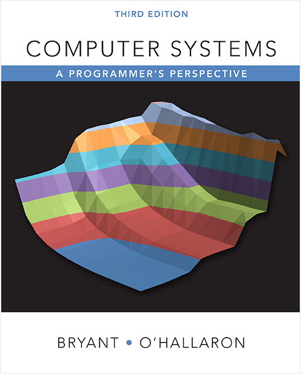

# <div align="center">Notes for CS:APP Labs</div>

<div align="center">

 

</div>

<p align="center">关于 CS:APP 的 Labs 的一些笔记与总结</p>

<br>

<br>

<div align="center"><a href="http://csapp.cs.cmu.edu/"></img></a></div>

## <a id="toc"></a>目录

<details open="open"><summary><a href="#1">1. Data Lab</a></summary>

- <a href="#1.1">实验目的</a>
- <a href="#1.2">实验框架</a>
  - <a href="#1.2.1">整数 puzzle</a>
  - <a href="#1.2.2">浮点数 puzzle</a>
  - <a href="#1.2.3">`btest` - 正确性检查工具</a>
  - <a href="#1.2.4">`dlc` - 合法性检查工具</a>
  - <a href="#1.2.5">`driver.pl` - 最终评分工具</a>
  - <a href="#1.2.6">其他</a>
- <a href="#1.3">实验思路与总结</a>
  - <a href="#1.3.1">#01 `bitXor` - 使用 `~` 和 `&` 实现 `^`</a>
  - <a href="#1.3.2">#02 `tmin` - 返回 </a>$TMin_w$
  - <a href="#1.3.3">#03 `isTmax` - 判断是否为 </a>$TMax_w$
  - <a href="#1.3.4">#04 `allOddBits` - 判断一个二进制模式的所有奇数位是否均为 1</a>
  - <a href="#1.3.5">#05 `negate` - 返回一个补码整数的相反数</a>
  - <a href="#1.3.6">#06 `isAsciiDigit`</a>
  - <a href="#1.3.7">#07 `conditional`</a>
  - <a href="#1.3.8">#08 `isLessOrEqual`</a>
  - <a href="#1.3.9">#09 `logicalNeg`</a>
  - <a href="#1.3.10">#10 `howManyBits`</a>
  - <a href="#1.3.11">#11 `floatScale2`</a>
  - <a href="#1.3.12">#12 `floatFloat2Int`</a>
  - <a href="#1.3.13">#13 `floatPower2`</a>
- <a href="#1.4">相关资料</a>
  - <a href="#1.4.1">命题逻辑</a>

</details>
<details><summary><a href="#2">2. Bomb Lab</a></summary>

- <a href="#2.1">实验目的</a>
- <a href="#2.2">实验框架</a>
  - <a href="#2.2.1">`bomb` - 待调试文件主体</a>
  - <a href="#2.2.2">`bomb.c` - 描述主体构成</a>
- <a href="#2.3">实验思路与总结</a>
  - <a href="#2.3.1">`sig_handler`</a>
  - <a href="#2.3.2">`initialize_bomb`</a>
  - <a href="#2.3.3">`string_length`</a>
  - <a href="#2.3.4">`strings_not_equal`</a>
  - <a href="#2.3.5">`explode_bomb`</a>
  - <a href="#2.3.6">`phase_defused`</a>
  - <a href="#2.3.7">`read_six_numbers`</a>
  - <a href="#2.3.8">`func4`</a>
  - <a href="#2.3.9">`fun7`</a>
  - <a href="#2.3.10">`phase_1`</a>
  - <a href="#2.3.11">`phase_2`</a>
  - <a href="#2.3.12">`phase_3`</a>
  - <a href="#2.3.13">`phase_4`</a>
  - <a href="#2.3.14">`phase_5`</a>
  - <a href="#2.3.15">`phase_6`</a>
  - <a href="#2.3.16">`secret_phase`</a>
- <a href="#2.4">相关资料</a>
  - <a href="#2.4.1">GDB</a>
  - <a href="#2.4.2">Linux 命令</a>

</details>
<details><summary><a href="#3">3. Attack Lab</a></summary>

- <a href="#3.1">实验目的</a>
- <a href="#3.2">实验框架</a>
  - <a href="#3.2.1">`ctarget`, `rtarget` - 可执行文件</a>
  - <a href="#3.2.2">`hex2raw` - 帮手程序</a>
  - <a href="#3.2.3">`farm.c` - 零件仓库</a>
  - <a href="#3.2.4">其他</a>
- <a href="#3.3">实验思路与总结</a>
  - <a href="#3.3.1">`ctarget` - level#1</a>
  - <a href="#3.3.2">`ctarget` - level#2</a>
  - <a href="#3.3.3">`ctarget` - level#3</a>
  - <a href="#3.3.4">`rtarget` - level#2</a>
  - <a href="#3.3.5">`rtarget` - level#3</a>
- <a href="#3.4">相关资料</a>

</details>
<details><summary><a href="#4">4. Cache Lab</a></summary>

- <a href="#4.1">实验目的</a>
- <a href="#4.2">实验框架</a>
  - <a href="#4.2.1">`csim.c` - 实现对高速缓存 cache 的模拟</a>
  - <a href="#4.2.2">`csim-ref` - 官方实现的高速缓存 cache 参考模拟器</a>
  - <a href="#4.2.3">`traces/` - 测试样例目录</a>
  - <a href="#4.2.4">`test-csim` - 对 cache 模拟器进行打分</a>
  - <a href="#4.2.5">`trans.c` - 实现最优化的矩阵转置</a>
  - <a href="#4.2.6">`test-trans.c` - 对矩阵转置函数实现进行打分</a>
  - <a href="#4.2.7">`Makefile`</a>
  - <a href="#4.2.8">`driver.py` - 最终评分工具</a>
  - <a href="#4.2.9">其他</a>
- <a href="#4.3">实验思路与总结</a>
  - <a href="#4.3.1">Part A</a>
  - <a href="#4.3.2">Part B</a>
    - <a href="#4.3.2.1">32 × 32</a>
    - <a href="#4.3.2.2">64 × 64</a>
    - <a href="#4.3.2.3">61 × 67</a>
  - <a href="#4.3.3">实验结果展示</a>
- <a href="#4.4">相关资料</a>

</details>
<details><summary><a href="#5">5. Shell Lab</a></summary>

- <a href="#5.1">实验目的</a>
- <a href="#5.2">实验框架</a>
  - <a href="#5.2.1">`Makefile` - 编译 tsh 和一些帮手程序, 以及自动化测试</a>
  - <a href="#5.2.2">`my<xxx>.c` - 帮手程序</a>
  - <a href="#5.2.3">`sdriver.pl` - 驱动程序</a>
  - <a href="#5.2.4">`trace{01-16}.txt` - 自动化测试序列</a>
  - <a href="#5.2.5">`tsh.c` - tsh 源文件</a>
  - <a href="#5.2.6">`tshref` - tsh 的参考实现</a>
  - <a href="#5.2.7">`tshref.out` - tsh 参考实现的自动化测试输出</a>
- <a href="#5.3">实验思路与总结</a>
  - <a href="#5.3.1">用于自动化测试的脚本</a>
  - <a href="#5.3.2">`tsh.c` 中已实现函数速查表</a>
  - <a href="#5.3.3">所需填充的函数的思路</a>
- <a href="#5.4">相关资料</a>

</details>
<details><summary><a href="#6">6. Malloc Lab</a></summary>

- <a href="#6.1">实验目的</a>
- <a href="#6.2">实验框架</a>
  - <a href="#6.2.1">`memlib.c` - 预定义的内存模型</a>
  - <a href="#6.2.2">`mm.c` - 待实现的分配器的骨架</a>
  - <a href="#6.2.3">`traces` - 测试样例</a>
  - <a href="#6.2.4">`mdriver.c` - 评分驱动程序</a>
  - <a href="#6.2.5">其他</a>
    - <a href="#6.2.5.1">注意事项</a>
    - <a href="#6.2.5.2">一些提示</a>
    - <a href="#6.2.5.3">关于评分工具 `./mdriver` 所使用的默认吞吐量配置</a>
    - <a href="#6.2.5.4">用于自动化测试的脚本</a>
- <a href="#6.3">实验思路与总结</a>
  - <a href="#6.3.1">最终得分</a>
  - <a href="#6.3.2">实现 `mm_malloc` 和 `mm_free`</a>
  - <a href="#6.3.3">DEBUG</a>
    - <a href="#6.3.3.1">`mm_free` 中忘记接住合并函数 `_coalesce` 的返回值</a>
    - <a href="#6.3.3.2">放置函数 `_place` 中对不分割的情况的处理存在错误</a>
    - <a href="#6.3.3.3">忘记在检查程序 `mm_check` 中释放内存</a>
  - <a href="#6.3.4">优化 `mm_malloc` 和 `mm_free`</a>
    - <a href="#6.3.4.1">测试样例 `binary-bal.rep` 和 `binary2-bal.rep` 的内存利用率过低</a>
  - <a href="#6.3.5">实现 `mm_realloc`</a>
  - <a href="#6.3.6">优化 `mm_realloc`</a>
- <a href="#6.4">相关资料</a>

</details>
<details><summary><a href="#7">GDB 入门</a></summary>
</details>
<details><summary><a href="#8">make 入门</a></summary>
</details>
<details><summary><a href="#9">待办</a></summary>
</details>

<div align="right"><b><a href="#toc">返回顶部↑</a></b></div>

## <a id="1"></a>1. Data Lab

### <a id="1.1"></a>实验目的

补全文件 `bits.c` 中所包含的全部 13 个 puzzle 的函数主体.

### <a id="1.2"></a>实验框架

- 完成后的函数主体参考如下风格:

  ```c
  /*
   * pow2plus1 - returns 2^x + 1, where 0 <= x <= 31
   */
  int pow2plus1(int x) {
     /* exploit ability of shifts to compute powers of 2 */
     return (1 << x) + 1;
  }

  /*
   * pow2plus4 - returns 2^x + 4, where 0 <= x <= 31
   */
  int pow2plus4(int x) {
     /* exploit ability of shifts to compute powers of 2 */
     int result = (1 << x);
     result += 4;
     return result;
  }
  ```

#### <a id="1.2.1"></a>整数 puzzle

- 仅允许使用函数形参和定义局部变量, 不允许定义全局变量.
- 仅允许使用白话代码 (straightline code) 完成每个函数, 不允许使用任何语句, 例如循环或条件语句等.
- 仅允许使用一元运算符 `!`, `˜`, 以及二元运算符 `&`, `ˆ`, `|`, `+`, `<<`, `>>`, **部分 puzzle 会进一步限制可用运算符的范围**.
- 仅允许使用 0 到 255 范围内的常数.
- 仅允许使用 `int` 类型.
- 不允许使用宏定义.
- 不允许定义新函数和调用任何函数.
- 不允许使用强制类型转换.
- 可以假设机器使用 32 位补码整数, 使用算数右移, 并且当位移量小于 0 或大于 31 时会导致无法预测的行为.

#### <a id="1.2.2"></a>浮点数 puzzle

- 仅允许使用条件或循环语句.
- 仅允许使用 `int` 和 `unsigned` 数据类型.
- 允许使用任意 `int` 和 `unsigned` 类型的常数.
- 允许使用任意算数, 逻辑和比较运算符.
- 不允许使用宏定义.
- 不允许定义新函数和调用任何函数.
- 不允许使用强制类型转换.

#### <a id="1.2.3"></a>`btest` - 正确性检查工具

- `btest` 需要与 `bits.c` 一同编译, 用于检测所实现函数的正确性, 基本命令 (测试所有函数):

  ```bash
  ./btest
  ```

- 每次修改 `bits.c` 之后均需要重新编译 `btest`.

- 可以使用选项 `-f` 来单独指定一个函数进行测试, 此外还可以通过选项 `-1`, `-2` 和 `-3` 来指定传入的实参, 命令:

  ```bash
  ./btest -f bitXor -1 4 -2 5
  ```

#### <a id="1.2.4"></a>`dlc` - 合法性检查工具

- 全称 data lab checker, 用于检测函数实现是否遵循上述规则, 基本命令:

  ```bash
  ./dlc bits.c
  ```

- 使用选项 `-e` 输出每个函数所使用的运算符的个数, 命令:

  ```bash
  ./dlc -e bits.c
  ```

- 使用命令 `./dlc -help` 查看文档.

- 程序 `dlc` 要求所有声明必须位于某个块中所有其他非声明语句之前.

- 赋值运算符 `=` 的使用次数不受限制.

#### <a id="1.2.5"></a>`driver.pl` - 最终评分工具

- `driver.pl` 用于为全部实验代码进行最终评分.

#### <a id="1.2.6"></a>其他

- 帮手程序 `ishow` 和 `fshow` 分别用于展示相应的二进制模式. 两个程序均只输入一个参数, 该参数可以是表示十进制数, 十六进制数和浮点数的字符串. 使用 `make` 对两个程序进行编译.

- 如果要使用 `printf` 语句进行 debug, 直接使用即可, 无需包含 `stdio.h` 头文件 (可能 gcc 会报 warning, 忽略即可).

- 具体打分细则见 handout.

<div align="right"><b><a href="#toc">返回顶部↑</a></b></div>

### <a id="1.3"></a>实验思路与总结

#### <a id="1.3.1"></a>#01 `bitXor` - 使用 `~` 和 `&` 实现 `^`

设两个比特 $p$ 和 $q$ 以及对应的命题 $P$ 和 $Q$, 在命题逻辑 (propositional logic) 下, 由德摩根定律 (De Morgan's laws), 异或运算可表示为

$$
\begin{equation}
P \oplus Q = (P \wedge \neg Q) \vee (\neg P \wedge Q) = \neg (\neg (P \wedge \neg Q) \wedge \neg (\neg P \wedge Q)), \tag{1} \label{1.3.1.bitXor-1}
\end{equation}
$$

将 $\eqref{1.3.1.bitXor-1}$ 式翻译至布尔代数下即为

```text
p ^ q = ~((~(p & (~q))) & (~((~p) & q))).
```

#### <a id="1.3.2"></a>#02 `tmin` - 返回 $TMin_w$

根据 $B2T_w$ 的定义,

$$
\begin{equation}
B2T_w (\boldsymbol{x}) \triangleq - x_{w - 1}2^{w-1} + \sum_{i=0}^{w-2} x_i 2^i,
\end{equation}
$$

最小值 $TMin_w = -2^{w - 1}$, 其二进制模式为 `0x100...00`, 即设置唯一的负权位即最高有效位为 1, 其他所有正权位为 0.

上述二进制模式在 C 语言下可利用移位运算得到:

```c
int tmin = 1 << 31; // 0x100...00
```

#### <a id="1.3.3"></a>#03 `isTmax` - 判断是否为 $TMax_w$

在没有任何运算符与常数使用限制的情况下, 判断一个整型值 $x$ 是否为 $TMax_w$ 只需将其二进制模式与 $TMax_w$ 的进行比较即可:

```c
x == 0x7fffffff
```

由于本题限制了整型常量的范围, 因此无法直接与 `0x7fffffff` 进行比较. 为了解决这一问题可以通过验证 $x$ 的二进制模式是否具有与 $TMax_w$ 的相同的性质来间接进行判断, 因为表达式能够产生的二进制模式的范围并无限制 (例如全 1 模式 `0x111...11` 无法直接使用, 但可通过对 0 取反, 即 `!0`, 来间接得到). 注意由于本题同时限制了移位运算符的使用, 因此即使通过表达式也同样无法间接获取 `0x7fffffff`.

$TMax_w$ 具有如下两个特殊性质 (二者均在模 $2^w$ 意义下成立):

1. $TMax_w$ 的位模式加 1 会上溢至 $TMin_w$ 的位模式;
1. $TMax_w$ 的位模式取反等于 $TMin_w$ 的位模式.

根据上述两个性质构造等量关系 (令 $TMax_w$ 的位模式为 $x$):

$$
\begin{equation}
x + 1 \equiv 2^{w} - 1 - x \ \ (\text{mod}\ \  2^{w}),
\end{equation}
$$

解得 $x = 2^{w - 1} - 1$ 或 $x = 2^{w} - 1$. 因此 $x$ 为 $TMax_w$ 的位模式当且仅当其满足如下约束:

$$
\begin{numcases}{}
x + 1 \equiv 2^{w} - 1 - x \ \ (\text{mod}\ \  2^{w}), \tag{2} \label{1.3.3.isTmax-1}\\
x \neq 2^w - 1. \tag{3} \label{1.3.3.isTmax-2}
\end{numcases}
$$

约束 $\eqref{1.3.3.isTmax-1}$ 左侧即为 `x + 1`, 右侧可表示为 `~x`. 由于整数 puzzle 同样限制了比较运算符的使用, 为了判断两个二进制位模式是否相同可以使用异或 `^` 与逻辑非 `!` 间接实现. 实际上两个位模式的异或结果为全 0 当且仅当这两个位模式相同, 而逻辑非能够方便的将异或结果转化为布尔值, 因此判断两个位模式 `x` 和 `y` 是否相同的表达式为 `!(x ^ y)`. 于是约束 $\eqref{1.3.3.isTmax-1}$ 可表示为:

```c
int x_plus_one = x + 1;
int x_complement = ~x;
int constraint_1 = !(x_plus_one ^ x_complement);
```

约束 $\eqref{1.3.3.isTmax-2}$ 成立当且仅当 $x$ 取反不为全 0. 为了将取反结果转化为布尔值, 需要使用逻辑非 `!` 进行转化:

```c
int constraint_2 = !!(~x);
```

使用连续两个 `!` 是因为单次转化得到的布尔值为原值的相反结果.

结合约束 $\eqref{1.3.3.isTmax-1}, \eqref{1.3.3.isTmax-2}$ 得到最终表达式:

```c
int is_tmax = constraint_1 & constraint_2;
```

#### <a id="1.3.4"></a>#04 `allOddBits` - 判断一个二进制模式的所有奇数位是否均为 1

所有特定位均为 1 当且仅当所有特定位的按位与的结果为 1. 由于最大允许运算符数量为 12, 直接顺次对每个位进行按位与的暴力解法不可行. 一种办法是通过折半移位同时对多个位进行按位与:

```c
int x_32 = x;
int x_16 = x_32 & (x_32 >> 16);
int x_8 = x_16 & (x_16 >> 8);
int x_4 = x_8 & (x_8 >> 4);
int x_2 = x_4 & (x_4 >> 2);
```

`x_2` 的次低有效位即为所有奇数位的按位与的结果:

```c
int are_all_odd_bits = (x_2 >> 1) & 1;
```

#### <a id="1.3.5"></a>#05 `negate` - 返回一个补码整数的相反数

最终实现为取反加一, 原理待补充.

#### <a id="1.3.6"></a>#06 `isAsciiDigit`

通过将两个模式相减并检查结果是否为负数来实现比较运算.

#### <a id="1.3.7"></a>#07 `conditional`

首先判断是否为零, 若为零则选择全 0 模式, 否则取反得到全 1 模式; 再使用按位与 `&` 进行条件选择.

#### <a id="1.3.8"></a>#08 `isLessOrEqual`

先检查两个数是否同号, 若同号则通过相减是否得到负数进行判断, 若异号直接检查哪一个数为正哪一个数为负即可.

#### <a id="1.3.9"></a>#09 `logicalNeg`

逻辑非等价于检查取反后的结果是否为全 0.

#### <a id="1.3.10"></a>#10 `howManyBits`

举例:

- `0x0001101` 需要 5 位, 具体为 `0x00 01101`, 即从左往右找最长连续相同的子串, 然后退一格断开. 思路是先将模式与其自身的右移一位结果进行按位异或, 得到每两位之间是否相同的结果, 最终答案的大小等于按位异或得到的模式中从左往右最长全等子串的长度关于 32 的补集. 注意由于至少需要 1 位进行表示, 所以需要对异或的结果至少将其与 1 进行按位或. 最后使用二分法找到该子串的补集的长度.

#### <a id="1.3.11"></a>#11 `floatScale2`

分情况讨论, 如果是特殊值, 直接返回; 如果是非规格化数, 直接对尾数部分进行左移; 否则就是规格化数, 对阶码加一即可. 注意如果加一之后变为特殊值还需要对尾数进行清空.

#### <a id="1.3.12"></a>#12 `floatFloat2Int`

分情况讨论, 如果阶码大于整型范围则直接返回 (由于返回值恰好为 -2147483648, 阶码真实值等于 31 的情况也可归纳至其中); 如果小于 0 则返回 0; 否则对尾数直接进行截断即可.

#### <a id="1.3.13"></a>#13 `floatPower2`

分情况讨论, 如果指数大于阶码范围则直接返回, 如果小于阶码范围则返回 0, 然后分别处理位于规格化范围和非规格化范围两种情况即可.

<div align="right"><b><a href="#toc">返回顶部↑</a></b></div>

### <a id="1.4"></a>相关资料

#### <a id="1.4.1"></a>命题逻辑

- [维基百科: 命题逻辑](https://en.wikipedia.org/wiki/Propositional_calculus)

## <a id="2"></a>2. Bomb Lab

### <a id="2.1"></a>实验目的

对可执行文件 `bomb` 进行调试, 深入其汇编代码, 依次推断出 6 个密码并通过相应 6 个阶段的考验. 除了这 6 个考验以外还存在第七个隐藏考验, 因此实际上共有 7 个阶段的考验以及对应的密码, 具体见下方小节.

### <a id="2.2"></a>实验框架

#### <a id="2.2.1"></a>`bomb` - 待调试文件主体

`bomb` 为可执行文件, 需要对其进行调试并破解得到 6 个密码 (加上隐藏考验总共为 7 个密码).

#### <a id="2.2.2"></a>`bomb.c` - 描述主体构成

`bomb.c` 中使用 C 程序描述了炸弹 bomb 的主体构成, 其中 `support.h` 与 `phases.h` 猜测是实现炸弹本体的代码的头文件.

观察 `bomb.c` 可得到 bomb 的构成如下:

- 首先检查命令行中是否给出文件路径, 并打开标准输入/给定文件.
- 初始化炸弹: `initialize_bomb();`
- 连续执行 6 个阶段, 每个阶段均为读入一行输入, 将输入用于解密, 若解密成功则可顺序进入下一阶段, 若 6 个阶段均解密成功则函数退出 (炸弹解除).
- 此外还可选择挑战第七个隐藏考验.

<div align="right"><b><a href="#toc">返回顶部↑</a></b></div>

### <a id="2.3"></a>实验思路与总结

目录结构:

- 可执行文件 `bomb` 的反汇编内容见文件[objdump_bomb.txt](2-bomb-lab/objdump_bomb.txt).
- 下列所有函数的机器指令的具体解释见目录[disas-output](2-bomb-lab/disas-output), 某些特定函数所需要的额外信息 (例如跳转表或全局字符串等) 将会在对应的 `disas_xxx.txt` 文件开头列出.
- 测试通过的 7 个密码见文件[password.txt](2-bomb-lab/password.txt).

#### <a id="2.3.1"></a>`sig_handler`

对炸弹拆除进度进行安全重置 `:-)`.

#### <a id="2.3.2"></a>`initialize_bomb`

函数 `initialize_bomb` 使用 C 库函数 `signal` 为信号 `SIGINT` 安装处理程序 `sig_handler`.

#### <a id="2.3.3"></a>`string_length`

函数 `string_length` 返回所传入字符串的长度.

#### <a id="2.3.4"></a>`strings_not_equal`

函数 `strings_not_equal` 检查传入的 2 个字符串是否相同.

#### <a id="2.3.5"></a>`explode_bomb`

函数 `explode_bomb` 输出 "炸弹拆除失败" 的提示信息并终止整个程序.

#### <a id="2.3.6"></a>`phase_defused`

函数 `phase_defused` 首先检查是否已经通过前 6 个阶段, 若仍未通过前 6 个阶段则直接返回; 若已经通过前 6 个阶段则尝试从第四个阶段的密码中读取开启隐藏阶段的口令, 若口令读取成功并且与一个已知字符串相同则进入隐藏阶段; 否则输出 "成功拆除炸弹" 的提示信息并返回.

#### <a id="2.3.7"></a>`read_six_numbers`

函数 `read_six_numbers` 从传入的字符串中读取 6 个整数.

#### <a id="2.3.8"></a>`func4`

函数 `func4` 在一个给定范围内对目标值进行二分查找, 并在递归过程中按一定规则产生最终的返回值.

- 注: 在二分查找时还 `func4` 还实现了补码下整数除以 2 的幂的算法.

#### <a id="2.3.9"></a>`fun7`

函数 `fun7` 在一棵简单的二叉搜索树中查找给定整数, 并在递归过程中按一定规则产生最终的返回值.

#### <a id="2.3.10"></a>`phase_1`

函数 `phase_1` 通过调用函数 `strings_not_equal` 来比较密码是否与一个已知字符串相同.

#### <a id="2.3.11"></a>`phase_2`

函数 `phase_2` 首先调用函数 `read_six_numbers` 从密码中读入 6 个整数, 然后检查这 6 个整数是否满足特定规则.

#### <a id="2.3.12"></a>`phase_3`

函数 `phase_3` 首先调用函数 `sscanf` 读入 2 个整数, 然后实现了一个简单的 C 语言 `switch` 语句来检查这 2 个数字是否满足特定规则.

#### <a id="2.3.13"></a>`phase_4`

函数 `phase_4` 首先调用函数 `sscanf` 读入 2 个整数, 然后将第一个整数传入函数 `func4` 并得到 1 个整数结果, 最后检查所返回的整数结果以及第二个整数是否满足特定规则.

#### <a id="2.3.14"></a>`phase_5`

函数 `phase_5` 将输入的密码字符串看作是一串整数数组, 通过将数组中的整数作为下标索引某个字母表来将整数数组映射为长度相等的新字符串, 最后比较新字符串是否与一个已知字符串相同.

#### <a id="2.3.15"></a>`phase_6`

函数 `phase_6` 首先调用函数 `read_six_numbers` 从密码中读取 6 个整数, 并使用这 6 个整数从某个全局链表中依次挑选出 6 个结点并连接形成一个新的链表, 最后检查新的链表中的值是否满足特定规则.

#### <a id="2.3.16"></a>`secret_phase`

函数 `secret_phase` 首先调用 `read_line` 函数读入第七个密码, 然后使用 C 库函数 `strtol` 将其转换为整数, 将该整数传入函数 `fun7` 得到结果, 最后检查该结果是否满足特定规则.

<div align="right"><b><a href="#toc">返回顶部↑</a></b></div>

### <a id="2.4"></a>相关资料

#### <a id="2.4.1"></a>GDB

- [Beej's Quick Guide to GDB](https://beej.us/guide/bggdb/)
- [GDB: The GNU Project Debugger](https://www.sourceware.org/gdb/)
- [gdbnotes-x86-64.pdf](http://csapp.cs.cmu.edu/3e/docs/gdbnotes-x86-64.pdf)
- stackoverflow: [How to highlight and color gdb output during interactive debugging?](https://stackoverflow.com/questions/209534/how-to-highlight-and-color-gdb-output-during-interactive-debugging)
  - GitHub: [gdb-dashboard](https://github.com/cyrus-and/gdb-dashboard)

#### <a id="2.4.2"></a>Linux 命令

- `objdump -t <binary-executable>`:

  - 打印符号表 (symbol table).

- `objdump -d <binary-executable>`:

  - 反汇编. 对于像系统调用 (例如 `sscanf`) 这样的函数而言, 反汇编得到的函数名有可能不是很直观, 此时在 gdb 中进行反汇编是更好的选择.

- `strings <binary-executable>`:

  - 打印可执行文件中的所有可打印字符串.

- `man ascii`:

  - 打印关于 ascii 编码的相关文档.

- `info gas`:

  - 打印关于 gas 的文档. 如果报错 `info: No menu item 'gas' in node '(dir)Top'`, 需要检查 `binutils` 包是否安装:

    ```bash
    # Check if binutils is installed
    which as

    # If binutils is not installed, install it
    sudo apt-get update
    sudo apt-get install binutils
    ```

    如果已经安装, 再检查是否安装文档 (因为有些 Linux 发行版可能会将 doc 和 software 分开打包):

    ```bash
    # Install documentation for binutils, which includes gas
    sudo apt-get install binutils-doc
    ```

<div align="right"><b><a href="#toc">返回顶部↑</a></b></div>

## <a id="3"></a>3. Attack Lab

### <a id="3.1"></a>实验目的

对两个可执行文件 `ctarget` 和 `rtarget` 成功实施共计 5 次攻击, 包括针对 `ctarget` 的 3 次攻击 level#1 至 level#3 以及对应的针对 `rtarget` 的 2 次升级版攻击 level#2 和 level#3.

攻击类型包括 "代码注入 (code-injection, CI)" 攻击和 "返回导向编程 (return-oriented-programming, ROP)" 攻击两种, 其中前者通过在攻击字符串中包含 (注入) 攻击代码来直接实现攻击, 后者通过在被攻击者的代码中寻找所谓 "零件 (gadget)" 并将其组合起来实现攻击.

### <a id="3.2"></a>实验框架

#### <a id="3.2.1"></a>`ctarget`, `rtarget` - 可执行文件

待实施攻击的可执行文件. `ctarget` 和 `rtarget` 均从标准输入 `stdin` 或者文件 `file` (使用选项 `-i file`) 中读取一个字符串, 代码如下所示:

```c
unsigned getbuf(){
    char buf[BUFFER_SIZE];
    Gets(buf);
    return 1;
}
```

其中函数 `Gets` 的作用和 C 标准库函数 `gets` 类似, 均为读取字符串至缓冲区 `buf` (并在末尾添加 `\0`). 由于函数 `Gets` 只是单纯地读入字符串, 并不检查缓冲区是否能够容纳得下该字符串, 因此如果输入的字符串足够长便会造成缓冲区溢出, 此时该字符串便可称为 "攻击字符串 (exploit strings)". 使用函数 `getbuf` 读入一个字符串有三种可能的结果:

1. 缓冲区能够容纳得下所读入的字符串, 此时函数 `getbuf` 将能够正常返回;
2. 缓冲区无法容纳字符串, 造成缓冲区溢出并导致普通的段错误, 此时函数 `getbuf` 无法正常返回;
3. 缓冲区无法容纳字符串, 造成缓冲区溢出, 但由于攻击字符串中包含精心构造的代码从而使得攻击者成功接管程序并实施攻击.

#### <a id="3.2.2"></a>`hex2raw` - 帮手程序

用于生成攻击字符串的帮手程序. 通过标准输入传入使用空白符 (空格或者换行符) 分隔的十六进制字符对, 输出与之对应的二进制字节, 例如传入 `30 31 32 33 34 35 00` 将输出二进制字节 `0x30313233343500`. 传入的内容中允许包含形如 C 语言块注释的注释, 即 `/* some comment */`. 注意需要确保在 `/*` 和 `*/` 的两边保留空格以便程序能够正确解析.

#### <a id="3.2.3"></a>`farm.c` - 零件仓库

这是用于实施 ROP 攻击的可用零件的源代码文件, 仅用于参考. 源代码已同 `rtarget` 一同编译形成二进制文件, 因此可在 `rtarget` 中找到对应机器代码.

#### <a id="3.2.4"></a>其他

- 在生成攻击字符串时可以将汇编代码存放在文件 (例如 `exploit.s`) 中 (汇编代码中字符 `#` 表示一行注释的开始), 使用命令 `gcc -c` 汇编生成二进制机器代码文件 (`exploit.o`), 再使用命令 `objdump -d` 反汇编生成包含汇编代码和机器代码的文件 (`exploit.d`), 最后配合使用 `hex2raw` 生成攻击字符串.
- 为了能够在离线环境下运行 `ctarget` 与 `rtarget`, 需要在命令行中使用选项 `-q` 禁止程序连接 CMU 服务器.
- 本实验可参考教材的 3.10.3 到 3.10.4 小节.
- 不允许使用攻击来绕过 validation 程序. 实际上实验要求攻击过程中跳转至的地址必须为下列地址中的其中一个:
  - 函数 `touch1`, `touch2`, 和 `touch3` 的起始地址.
  - 注入代码的起始地址.
  - 零件仓库中的任意函数的起始地址.
- 在对 `rtarget` 实施返回导向编程攻击时只允许使用位于函数 `start_farm` 和 `end_farm` 之间的代码生成零件.

> [!CAUTION]
>
> 在运行 `ctarget` 时可能会报如下错误:
>
> ```text
> Program received signal SIGSEGV, Segmentation fault.
> 0x00007ffff7dfe0d0 in __vfprintf_internal (s=0x7ffff7fa4780 <_IO_2_1_stdout_>, format=0x4032b4 "Type string:", ap=ap@entry=0x5561dbd8, mode_flags=mode_flags@entry=2) at ./stdio-common/vfprintf-internal.c:1244
> ```
>
> 对应位置的汇编代码为:
>
> ```text
>  0x00007ffff7dfe0c0  __vfprintf_internal+144 movdqu (%rax),%xmm1
>  0x00007ffff7dfe0c4  __vfprintf_internal+148 movups %xmm1,0x118(%rsp)
>  0x00007ffff7dfe0cc  __vfprintf_internal+156 mov    0x10(%rax),%rax
>  0x00007ffff7dfe0d0  __vfprintf_internal+160 movaps %xmm1,0x10(%rsp)
>  0x00007ffff7dfe0d5  __vfprintf_internal+165 mov    %rax,0x128(%rsp)
> ```
>
> 调试过程具体见[debug.md](3-attack-lab/debug.md).
>
> 查阅网络资料后得知报错的直接原因是汇编代码
>
> ```text
> 0x00007ffff7dfe0d0  __vfprintf_internal+160 movaps %xmm1,0x10(%rsp)
> ```
>
> 中的指令 `movaps` 要求目的地址 `0x10(%rsp)` 必须与 16 字节对齐, 否则会导致段错误. 而报错的根本原因可能是 `ctarget` 程序编译时的环境和当前执行的环境不同, 导致调用 `printf` 函数时无法保证 `movaps` 指令的目的地址总是与 16 字节对齐.
>
> 由于上述问题, 在运行 `ctarget` 与 `rtarget` 的过程中要尽可能避免程序调用 `printf` 函数, 例如在运行前应使用选项 `-i <input-file>` 指定输入文件路径, 因为若使用标准输入会导致程序调用 `printf` 函数输出提示信息 "Type string:" 从而造成段错误; 此外在执行完攻击代码结束并返回时也会调用 `printf` 函数输出攻击成功的提示信息, 尽管此时无法避免调用 `printf` 函数, 但可以通过在攻击代码中增加对齐 `$rsp` 的功能的方法成功调用 `printf` 函数.

<div align="right"><b><a href="#toc">返回顶部↑</a></b></div>

### <a id="3.3"></a>实验思路与总结

#### <a id="3.3.1"></a>`ctarget` - level#1

目标: 利用栈溢出漏洞使函数 `test` 在返回时跳转至函数 `touch1` 处.

- 通过反汇编 `test` 函数可知 `test` 函数的工作是调用 `getbuf` 函数, 若 `getbuf` 成功返回则打印字符串 "No exploit. Getbuf returned 0x%x\n". 因此攻击目标调整为使函数 `getbuf` 返回至 `touch1` 处.
- 通过反汇编 `getbuf` 函数可知字符串的缓冲区的大小固定为 `0x28` 字节, 紧随缓冲区之后的 8 个字节内存存放的即为函数 `getbuf` 的返回地址.
- 通过反汇编代码内容可知函数 `touch1` 的入口地址为 `0x00000000004017c0`.

因此最终的攻击策略是将攻击字符串的前 40 字节设置为任意内容用于填充缓冲区的 40 字节, 然后将接下来的 8 个字节设置为函数 `touch1` 的入口地址. 具体见文件[c1.txt](3-attack-lab/c1.txt).

#### <a id="3.3.2"></a>`ctarget` - level#2

目标: 利用栈溢出漏洞使函数 `test` 在返回时跳转**并调用**函数 `touch2`.

> [!NOTE]
> 在使用攻击代码进行函数调用时不需要使用 `jmp` 或 `call` 指令, 因为这些指令可能要求使用偏移地址而非绝对地址, 而偏移地址较为难以计算. 若要实现函数跳转, 直接使用 `ret` 指令配合绝对地址即可, 由于函数 `touch2` 并不包含返回语句 (其使用 C 库函数 `exit()` 直接终止程序的运行), 因此不需要考虑是否需要使用 `call` 指令压入返回地址等问题.

- 由于需要调用函数 `touch2` 并传入参数, 直接使用地址跳转至特定函数的方法此时便不再适用, 因为并不存在现有的函数实现 "跳转至函数 `touch2` 并传入给定参数" 的功能, 因此需要在攻击字符串中直接注入攻击代码.
- 若要使函数 `getbuf` 执行攻击字符串中包含的攻击代码, 需要使其原地返回至攻击代码的入口地址 (该地址仍位于字符串中, 因此称之为 "原地返回"). 通过反汇编代码内容可知进入 `getbuf` 时 (同时在分配缓冲区局部变量前) 寄存器 `$rsp` 的值为 `0x000000005561dca0`, 因此攻击字符串中的返回地址应设置为 `$rsp + 8` 即 `0x000000005561dca8`.
- 若要调用函数 `touch2`, 汇编代码首先需要将 cookie 作为参数传入 `touch2`, 然后通过移动 `$rsp` 至存储有函数 `touch2` 的入口地址的内存上并执行 `ret` 指令的方法调用函数 `touch2`. 函数 `touch2` 的入口地址为 `0x00000000004017ec`.
- 此外还需要对齐指针的 8 字节以及对齐前述的 `movaps` 指令的 16 字节, 因此需要额外注意移动 `$rsp` 的距离的设置.

综上可知攻击策略为 40 字节 padding + 8 字节攻击代码入口地址 + 攻击代码 (传入参数, 移动 `$rsp`, 执行 `ret`) + 16 字节对齐 padding + 函数 `touch2` 的入口地址. 具体见文件[c2.txt](3-attack-lab/c2.txt).

#### <a id="3.3.3"></a>`ctarget` - level#3

思路:

- 将 cookie 字符串存储在攻击字符串中
- 将 cookie 字符串起始地址传入函数 `touch3`, 注意此处应使用 `lea` 指令
- 将 `touch3` 的入口地址包含在攻击字符串中
- 移动 `$rsp`
- 执行 `ret` 命令

方案:

- 攻击字符串 = 40 字节 padding + 攻击代码入口地址 + 攻击代码 (传入 cookie 字符串起始地址, 移动 `$rsp`, 执行 `ret`) + 对齐 padding + `touch3` 入口地址 + cookie 字符串.

数据:

- 攻击代码入口地址和 level#2 一样, 为 `0x000000005561dca8`
- `touch3` 入口地址为 `0x00000000004018fa`
- cookie 为 `0x59b997fa`, 转换为小写十六进制字符串为 `35 39 62 39 39 37 66 61`
- 对齐 padding 的长度取决于攻击代码的长度和位置, 由于攻击代码的长度同 level#2 一样, 因此对齐 padding 的长度也同样不变, 为 16 - 2 = 14 字节
- cookie 字符串的起始地址取决于对齐 padding 的长度和位置, 为 `$rsp + 10 + 14 + 8`
- 攻击代码中移动 `$rsp` 的距离取决于对齐 padding 的长度和位置, 为 `10 + 14`

具体见文件[c3.txt](3-attack-lab/c3.txt).

#### <a id="3.3.4"></a>`rtarget` - level#2

> [!NOTE]
>
> - level#2 只允许使用 `farm.c` 中位于 `start_farm` 和 `mid_farm` 之间的零件.
> - 尽管可以使用在 `start_farm` 和 `mid_farm` 之间的所有零件, 本阶段只需使用 `movq`, `popq`, `ret` 和 `nop` 四个类型的指令以及前 8 个寄存器 `$rax`, `$rbx`, `$rcx`, `$rdx`, `$rbp`, `$rsp`, `$rsi`, `$rdi` 即可构建出成功攻击 `rtarget` - level#2 所需的零件. (在 level#3 中可能还要用到包含有 `lea` 指令的零件[待办])
> - handout 中明确指出解决 level#2 只需要 2 个零件.
>   由于 `mov` 指令并不改变 `$rsp`, 而 `pop` 指令仅将栈中数据弹出至寄存器, 因此攻击字符串的结构应为入口地址与数据的交替组合.

思路:

- 无法再通过在攻击字符串中包含代码的方式执行攻击, 因为包含栈的内存区域被标记为了 `nonexecutable`, 同时栈的位置也被随机化了, 因此既无法跳转至攻击代码, 即使跳转到了也无法执行.
- 虽然由于栈随机化而无法执行攻击者自己希望注入的代码, 但是代码的相对位置不会轻易发生改变, 而被攻击者的代码中也可能包含有一些虽然功能简单但组合起来也许能够实现攻击目的指令模式, 称为 "零件 (gadget)", 并且返回指令 `ret` 仍然有效, 于是可以利用返回指令配合巧妙的零件组合, 通过在不同零件之间跳转来实现攻击.
- 为了重新实现在 `ctarget` 中的 level#2 攻击, 需要想办法将 cookie 的值传送至 `$rdi` 并将 `$rsp` 指向存储有函数 `touch2` 入口地址的内存地址. 此时攻击字符串中只有存储数据才是有意义的, 因此可以使用 `popq` 配合在攻击字符串中包含数据来实现自定义数据的传送, 使用 `movq` 实现特定方向的数据传送, 使用 `popq` 和 `ret` 配合在攻击字符串中包含地址来实现跳转.

指令模式归纳:

- `movq` 指令的字节模式是 `48 89` 加上 `c0`-`ff` 中的某一个数, 其中 `c0`-`ff` 总共有 64 种可能, 对应于 8 个寄存器之间两两配对.
- `popq` 指令的字节模式是 `58`-`5f`, 共 8 种可能, 对应 8 个寄存器.
- `ret` 指令的字节模式是单字节 `c3`.
- `nop` 指令的字节模式是单字节 `90`.

找到的零件:

| 零件    | 汇编代码         | 机器代码      | 入口地址   | 位于函数                           |
| ------- | ---------------- | ------------- | ---------- | ---------------------------------- |
| 零件 #1 | `movq %rax %rdi` | `48 89 c7 c3` | `0x4019a2` | (1) `addval_273`, (2) `setval_426` |
| 零件 #2 | `popq %rax`      | `58 90 c3`    | `0x4019ab` | (1) `addval_219`, (2) `getval_280` |

方案:

- 使用零件 #2 将 cookie 值出栈至 `$rax`
- 使用零件 #1 将 `$rax` 传送至 `$rdi`
- 攻击字符串 = 40 字节 padding + 零件 #2 的入口地址 + cookie 值 + 零件 #1 的入口地址 + 函数 `touch2` 的入口地址

具体见文件[r2.txt](3-attack-lab/r2.txt).

#### <a id="3.3.5"></a>`rtarget` - level#3

> [!NOTE]
>
> - level#3 允许使用整个位于 `start_farm` 和 `end_farm` 之间的所有零件.
> - handout 中明确指出解决 level#3 共需要 8 个零件, 并且零件可重复使用.

指令模式归纳:

- `movl` 指令的字节模式是 `89` 加上 `c0`-`ff` 中的某一个数, 同 `movq` 指令类似.
- 功能性 (functional) `nop` 指令, 即逻辑上不是 `nop` 指令但实际执行起来相当于 `nop` 指令的指令:

  - `andb`: 以 `20` 开头.
  - `orb`: 以 `08` 开头.
  - `cmpb`: 以 `38` 开头.
  - `testb`: 以 `84` 开头.

  这四个指令头需要配合字节 `c0`, `c9`, `d2`, `db` (分别对应 `$al`, `$cl`, `$dl`, `$bl`) 来构成完整的指令. 例如 `20 c0` 代表指令 `andb %al`.

找到的零件:

| 零件              | 汇编代码                 | 机器代码         | 入口地址   | 位于函数                                                               |
| ----------------- | ------------------------ | ---------------- | ---------- | ---------------------------------------------------------------------- |
| 零件 #1 (level#2) | `movq %rax %rdi`         | `48 89 c7 c3`    | `0x4019a2` | (1) `addval_273`, (2) `setval_426`                                     |
| 零件 #2 (level#2) | `popq %rax`              | `58 90 c3`       | `0x4019ab` | (1) `addval_219`, (2) `getval_280`                                     |
| 零件 #3           | `movq %rsp %rax`         | `48 89 e0 c3`    | `0x401a06` | (1) `addval_190`, (2) `setval_350`                                     |
| 零件 #4           | `movl %eax %edi`         | `89 c7 c3`       | `0x4019a3` | (1) `addval_273`, (2) `setval_426`                                     |
| 零件 #5           | `movl %eax %edx`         | `89 c2 90 c3`    | `0x4019dd` | (1) `getval_481`, (2) `addval_487`                                     |
| 零件 #6           | `movl %esp %eax`         | `89 e0 c3`       | `0x401a07` | (1) `addval_190`, (2) `addval_110`, (3) `addval_358`, (4) `setval_350` |
| 零件 #7           | `movl %ecx %esi`         | `89 ce 90 90 c3` | `0x401a13` | (1) `addval_436`, (2) `addval_187`                                     |
| 零件 #8           | `movl %edx %ecx`         | `89 d1 38 c9 c3` | `0x401a34` | (1) `getval_159`, (2) `getval_311`                                     |
| 零件 #9           | `lea (%rdi,%rsi,1) %rax` | `48 8d 04 37 c3` | `0x4019d6` | (1) `add_xy`                                                           |

思路:

- 由于 `movq %rsp` 指令仅仅记录当前的 `$rsp` 值, 而不是攻击字符串中 cookie 所处的位置, 因此仅仅使用 `movq` 或 `movl` 指令是无法攻击成功的. 直接使用 `popq` 指令试图将 cookie 的地址弹出到 `$rax` 中也是不现实的, 因为程序使用了栈随机化技术, cookie 字符串的地址无法提前硬编码至攻击字符串中. 整个攻击过程中唯一固定不变的是攻击字符串本身, 或者说攻击字符串中各个要素之间的偏移. 因此要想攻击成功必须使用 `movq $rsp` 指令记录栈的基位置 (base position), 消除栈随机化的影响, 然后使用算数指令计算出 cookie 位于攻击字符串中的确切位置. 而能够找到的最明显的算数运算指令就是零件 #9 `lea (%rdi,%rsi,1) %rax`.
- cookie 在攻击字符串中的偏移由其位于各个零件中的位置决定.

方案:

- 使用零件 #3 存储栈的基位置至 `$rax`
- 使用零件 #1 将栈的基位置由 `$rax` 传送至 `$rdi`
- 使用零件 #2 将 cookie 的偏移弹出至 `$rax`
- 使用零件 #5, #8, #7 将 cookie 的偏移由 `$rax` 传送至 `$rsi`
- 使用零件 #9 计算 cookie 字符串的首地址, 存储至 `$rax`
- 使用零件 #1 将指针传入函数 `touch3`
- 攻击字符串 = 40 字节 padding + 零件 #3 的入口地址 + 零件 #1 的入口地址 + 零件 #2 的入口地址 + cookie 字符串的偏移 + 零件 #5, #8, #7 的入口地址 + 零件 #9 的入口地址 + 零件 #1 的入口地址 + 函数 `touch3` 的入口地址 + cookie 字符串

具体见文件[r3.txt](3-attack-lab/r3.txt).

<div align="right"><b><a href="#toc">返回顶部↑</a></b></div>

### <a id="3.4"></a>相关资料

无

## <a id="4"></a>4. Cache Lab

### <a id="4.1"></a>实验目的

(1) 补全源文件 `csim.c` 以实现模拟一个高速缓存 cache; (2) 补全源文件 `trans.c` 以尽可能少的不命中次数实现对一个矩阵的转置.

### <a id="4.2"></a>实验框架

#### <a id="4.2.1"></a>`csim.c` - 实现对高速缓存 cache 的模拟

在本文件中使用 C 代码模拟一个高速缓存 cache, 其以 `valgrind` 的内存跟踪信息作为输入, 模拟内存操作过程中一个 cache 的行为, 然后分别输出命中 (hit) 次数, 不命中 (miss) 次数以及驱逐 (eviction) 次数.

- 除了实现对 cache 的模拟以外还需要实现同样的参数爬取逻辑, 这可以借助 C 函数 `getopt` 实现, 需要用到的头文件包括:

  ```c
  #include <getopt.h>
  #include <stdlib.h>
  #include <unistd.h>
  ```

  `getopt` 函数的官方文档链接见 "相关资料" 小节.

- 模拟器必须对任意 $s$, $E$, $b$ 都能够得到正确结果, 这可以借助 C 函数 `malloc` 来实现, `malloc` 函数的文档可使用 Linux 命令 `man malloc` 查看.
- 本实验不要求对指令 cache 的模拟, 因此可以忽略 `xxx.trace` 文件中所有以 `I` 开头的行.
- 必须在 `main` 函数的结尾调用函数 `printSummary(hit_count, miss_count, eviction_count)` 来得到具有官方格式的输出.
- 本实验中可完全假设内存操作的 `size` 字节数据总是能够容纳在 cache 行的块中, 即 $size \leq B$.
- 建议像官方模拟器 `csim-ref` 一样实现 `-v` 选项

#### <a id="4.2.2"></a>`csim-ref` - 官方实现的高速缓存 cache 参考模拟器

用法: `./csim-ref [-hv] -s <s> -E <E> -b <b> -t <tracefile>`

- `-h`: 打印帮助信息.
- `-v`: verbose 模式, 打印详细的跟踪信息.
- `-s <s>`: 组 (set) 索引位数 $s$ (组的数量 $S = 2^s$ )
- `-E <E>`: 相联度 (associativity) $E$ (即组相联中每组包含的行数)
- `-b <b>`: 块大小的对数 $b = \log_2 (B)$ (B 为块大小)
- `-t <tracefile>`: 要模拟的 valgrind 跟踪文件的文件名

- handout 中明确指出官方模拟器使用 LRU (least-recently used) 策略决定驱逐对象.
- 使用 `traces/write_allocate_or_not.trace` 可以得知官方模拟器使用 "写分配" 策略作为写不命中时的策略.

#### <a id="4.2.3"></a>`traces/` - 测试样例目录

包含一系列用于测试 `csim.c` 的参考跟踪文件 (reference trace files).

其下的文件的文件名形如 `xxx.trace`, 这些文件是由一个名为 `valgrind` 的 Linux 程序生成的, 其作用是跟踪一个程序的内存使用情况. 典型的 `xxx.trace` 文件的内容格式如下:

```text
I 0400d7d4,8
 M 0421c7f0,4
 L 04f6b868,8
 S 7ff0005c8,8
```

其中每一行代表一次或两次内存读写操作, 且均具有格式 `[space]operation address,size`:

- `[space]` 表示可选的一个空格, 实际上当且仅当前缀为 `I` 时不加这个可选的空格.
- `operation` 可以是 `I`, `L`, `S` 和 `M`, 分别表示 "取指令", "加载数据", "存储数据" 和 "修改数据 (即加载数据 + 存储数据)".
- `address` 表示一个 64 位十六进制内存地址.
- `size` 表示所操作的字节数.

#### <a id="4.2.4"></a>`test-csim` - 对 cache 模拟器进行打分

对所实现的 `csim.c` 进行打分.

用法:

```bash
linux> make
linux> ./test-csim
```

打分时将使用一系列不同的 cache 配置对编译得到的 `csim` 程序进行评测:

```bash
linux> ./csim -s 1 -E 1 -b 1 -t traces/yi2.trace
linux> ./csim -s 4 -E 2 -b 4 -t traces/yi.trace
linux> ./csim -s 2 -E 1 -b 4 -t traces/dave.trace
linux> ./csim -s 2 -E 1 -b 3 -t traces/trans.trace
linux> ./csim -s 2 -E 2 -b 3 -t traces/trans.trace
linux> ./csim -s 2 -E 4 -b 3 -t traces/trans.trace
linux> ./csim -s 5 -E 1 -b 5 -t traces/trans.trace
linux> ./csim -s 5 -E 1 -b 5 -t traces/long.trace
```

除了最后一个样例为 6 分以外, 其余样例均为 3 分, 共计 27 分.

#### <a id="4.2.5"></a>`trans.c` - 实现最优化的矩阵转置

编写一个函数, 以尽可能少的不命中次数实现对矩阵的转置.

本文件中可以同时实现多个 (最多 100 个) 不同版本的矩阵转置函数, 每个函数需要使用特殊语句进行注册 (register):

```c
char my_trans_desc[] = "This is the description of `my_trans`";
void my_trans(int M, int N, int A[N][M], int B[M][N]);

registerTransFunction(my_trans, my_trans_desc);
```

将 `my_trans` 替换为任意函数名.

本文件中名为 `transpose_submit` 的函数表示提交版本, 可以将最终答案复制粘贴进这个函数. 请勿改动其对应注册字符串的内容防止注册失败.

- 每个版本的转置函数中均仅允许定义不超过 12 个 `int` 类型的局部变量 (包括转置函数本身和其调用的所有帮手函数中的所有局部变量), 这是因为本实验的打分程序并不对栈进行跟踪, 同时也因为本实验的目的就是专注于高速缓存而不是内存的访问.
- 不允许在转置函数中使用递归.
- 不允许更改所传入的矩阵 A 的内容, 不过对矩阵 B 可以随便操作.
- 不允许定义任何数组或者使用函数 `malloc` 和其任意变种.
- 如果要进行 debug 可以使用 `test-trans` 程序输出对应的 $\texttt{trace.f}i$ 然后使用 `-v` 选项运行参考 cache 模拟器.
- 因为测试时所用的 cache 配置为直接映射, 可能会发生抖动的问题, 因此在实现时要注意访问模式, 特别是沿着对角线时 (原文是 "think about the potential for conflict misses in your code, especially along the diagonal"). 尽量采取能够尽可能减少抖动的访问模式.
- 实现时可以采取 "分块" 的思想提高时间局部性, 减少 cache 不命中次数, 具体见 "相关资料" 小节.

#### <a id="4.2.6"></a>`test-trans.c` - 对矩阵转置函数实现进行打分

对所实现的 `trans.c` 进行打分.

用法:

```bash
linux> make
linux> ./test-trans -M 32 -N 32
```

实验过程中进行测试时可以使用任意矩阵配置, 但最终打分时仅会使用如下三种不同的矩阵配置:

- $32 \times 32 ~~(M = 32, ~~N = 32)$
- $64 \times 64 ~~(M = 64, ~~N = 64)$
- $61 \times 67 ~~(M = 61, ~~N = 67)$

具体打分过程是使用 `valgrind` 对编译得到的 `trans` 程序提取其跟踪信息, 然后传入参考 cache 模拟器 (配置固定为 $(s = 5, ~~E = 1, ~~b = 5)$) 获取未命中次数 $m$, 根据 $m$ 的值进行打分. $m$ 的值越小得分越高, 共计 26 分, 其中第一个配置的未命中数小于 300 时得满分, 第二个配置小于 1300 时得满分, 而第三个配置小于 2000 时得满分. 具体打分规则见 handout.

- 本实验仅要求针对上述给出的三种矩阵配置以及参考模拟器的配置进行优化, 因此完全可以针对三种矩阵配置实现三个不同的函数, 然后在主函数中检查矩阵大小并分发给对应函数.
- `test-trans` 程序会对 `valgrind` 的输出进行过滤, 剔除任何和栈有关的内存访问, 这是因为 `valgrind` 的输出中关于栈的部分绝大部分都跟本实验的代码无关. 但是也因为过滤掉了和本实验有关的栈访问, 所以本实验禁用了栈 (即数组) 的使用并限制了局部变量的使用.

#### <a id="4.2.7"></a>`Makefile`

- 可以使用如下命令编译所有程序:

  ```bash
  linux> make clean
  linux> make
  ```

#### <a id="4.2.8"></a>`driver.py` - 最终评分工具

对整个实验的实现进行评分.

用法:

```bash
linux> ./driver.py
```

具体打分过程是首先调用 `test-csim` 程序对 cache 模拟器进行评分, 然后调用 `test-trans` 对矩阵转置函数进行打分.

#### <a id="4.2.9"></a>其他

- 程序要完全正常地通过编译, 不能够报任何 warning.

<div align="right"><b><a href="#toc">返回顶部↑</a></b></div>

### <a id="4.3"></a>实验思路与总结

#### <a id="4.3.1"></a>Part A

- 主要任务是模拟一个具有组索引位数 $s$, 相联度 $E$ 和块偏移位数 $b$ 的 cache, 因为需要使用 LRU 作为驱逐策略, 所以用一个链表表示一个 cache 的组是比较合适的, 元素在链表中越靠前就代表其最近一次使用时间越晚, 然后通过遍历链表中的元素来模拟在组中查找特定行的行为. 若找到或者需要新载入一个行只需要将该行插入表头之后即可.
- 由于写不命中时的策略是写分配, 所以写不命中的效果等价于读不命中的效果. 又因为写命中的效果等价于读命中的效果, 所以整个写操作的效果等价于读操作的效果. 而修改操作又等价于一个读操作加一个写操作, 所以总的加起来实际上只需要实现一个读操作即可.
- 为了爬取 traces 文件所需的 I/O 操作以及爬取传入参数所需的 `getopt` 操作属于工具类代码, 并不是本实验考察的重点.
- 由于选择了链表 (为了方便实际上采用了双链表) 作为 cache 的实现, 在写代码时格外需要注意常规的链表操作, 例如插入删除的先后顺序等等.

#### <a id="4.3.2"></a>Part B

- 首先整个 Part B 使用的都是 $s = 5, E = 1, b = 5$ 的 cache 配置, 其中 $s = 5$ 和 $b = 5$ 意味着 cache 行的块大小为 32 字节并且总共有 32 行, 对于 `int` 类型的整数而言, cache 的一行能包含 8 个整数; 而 $E = 1$ 意味着 cache 是直接映射, 每个组仅包含一行 (即相联度为 1), 于是每 8 × 32 = 256 个 `int` 整数就会占据一遍所有组, 也就是整个 cache 只能在同一时间保存 32 个组索引互不相同的 8 整数长条的副本.
- 其次本实验部分的评价标准完全是 cache 未命中 (miss) 次数. 对于一个数据块, 若要对其进行处理, 就必须要将其读入 cache (前提是写分配, 写不分配直接对内存进行写入), 因此首次读入时必然会 miss 一次, 这是不可避免的. 为了降低 miss 次数, 真正的关键在于减少 "处理一次没处理完, 下次又要再读入" 的抖动现象, 因此整个思路应该围绕着 "如何单次读取单次处理完毕" 来展开.

> [!NOTE]
>
> 在 `tracegen.c` 中可以找到矩阵 A 和 B 的定义:
>
> ```c
> static int A[256][256];
> static int B[256][256];
> ```
>
> 通过 GDB 可知 A 的初始地址为 `0x70a0`, B 的初始地址为 `0x470a0` (中间恰好相差 256 × 256 × 4 个字节). 因此 A 的初始地址以及 B 的初始地址都是和 $s = 5, ~~ E = 1, ~~ b = 5$ 配置下的 cache 对齐的, 并且 A 的初始地址对应的 cache 行号和 B 的初始地址对应的行号也相同.

##### <a id="4.3.2.1"></a>32 × 32

- 列数等于 32 意味着矩阵的每行等于 cache 的 4 行, 因此矩阵每 8 行就会对应一遍整个 cache.
- 由于 cache 中的一个块等于 8 个 `int`, 所以矩阵一行中的每 8 个整数长条对应一个块, 一行可以划分为连续的 4 个长条, 对应于连续的 4 个 cache 块.
- 为了尽量提高空间局部性, 最好就是一个 8 整数长条 (对应一个 cache 块) 仅加载一次就完成转置, 此后在逻辑上将该块所占用的 cache 行视作 "可用".
- 由于要做的是转置, 所以 "行" 要对应至 "列", 又由于一次要转置一个 8 整数长条, 因此将矩阵分为 8 × 8 的小块 (分块完之后 A 就成为 4 × 4 分块矩阵) 来分别进行处理是比较好的方法.
- 将 A 转置到 B 至少需要对 A 完全读取一遍, 对 B 完全写入一遍, 因此 miss 次数至少为 8 × (4 × 4) × 2 = 256 次. 满分为 300 次.
- 非对角 8 × 8 小块所占据的 cache 空间互不重合, 因此可以放心按照一般的遍历顺序进行转置. 转置一个块所产生的 miss 次数为 16 次, 即最优情况. 对角 8 × 8 小块需要利用到 12 个局部变量的帮助, 转置一个块产生的 miss 次数为 20 次. 理论 miss 总次数为 272 次, 实际为 276 次.

##### <a id="4.3.2.2"></a>64 × 64

- 矩阵一行现在对应于 8 个 cache 块. 同样对矩阵采取划分为 8 × 8 小块的分块方式.
- 整个 cache 现在仅对应于 4 个矩阵行, 这意味着现在即使是非对角块其上半部分和下半部分所占据的 cache 空间也会重叠. 对角块的重叠情况比非对角块还严重.
- 使用 12 个局部变量仍然能够做到对非对角块的一次处理, 一个块的 miss 次数仍然为 16 次. 对角块则直接放弃尝试一次处理, 采用对其进行 4 × 4 分块并利用 12 个局部变量尽可能减少 miss 次数, 一个块的 miss 次数为 32 次. 理论 miss 总次数为 1152 次, 实际为 1156 次.

##### <a id="4.3.2.3"></a>61 × 67

- 因为矩阵的维数不再与 cache 相互对齐, 所以想要做到单次读取单次处理不现实. 最好的做法是仍然采取像 64 × 64 矩阵中那样的分块方案, 在一定程度上降低 miss 总数的数学期望值.
- 对于完整的 8 × 8 对角块与非对角块, 处理方法是将其当作 64 × 64 中的对角块与非对角块来进行处理 (实际上代码就是复制粘贴 64 × 64 方案中的).
- 对于剩下的不完整的边角料, 处理方案是每 4 行 (对于右侧边角料块) 或每 4 列 (对于下方边角料块) 循环遍历, 减少抖动. 实际 miss 总次数为 2140 次 (满分阈值 2000 次).

#### <a id="4.3.3"></a>实验结果展示

```text
Part A: Testing cache simulator
Running ./test-csim
                        Your simulator     Reference simulator
Points (s,E,b)    Hits  Misses  Evicts    Hits  Misses  Evicts
     3 (1,1,1)       9       8       6       9       8       6  traces/yi2.trace
     3 (4,2,4)       4       5       2       4       5       2  traces/yi.trace
     3 (2,1,4)       2       3       1       2       3       1  traces/dave.trace
     3 (2,1,3)     167      71      67     167      71      67  traces/trans.trace
     3 (2,2,3)     201      37      29     201      37      29  traces/trans.trace
     3 (2,4,3)     212      26      10     212      26      10  traces/trans.trace
     3 (5,1,5)     231       7       0     231       7       0  traces/trans.trace
     6 (5,1,5)  265189   21775   21743  265189   21775   21743  traces/long.trace
    27


Part B: Testing transpose function
Running ./test-trans -M 32 -N 32
Running ./test-trans -M 64 -N 64
Running ./test-trans -M 61 -N 67

Cache Lab summary:
                        Points   Max pts      Misses
Csim correctness          27.0        27
Trans perf 32x32           8.0         8         276
Trans perf 64x64           8.0         8        1156
Trans perf 61x67           8.6        10        2140
          Total points    51.6        53
```

<div align="right"><b><a href="#toc">返回顶部↑</a></b></div>

### <a id="4.4"></a>相关资料

- [分块 (blocking) - 提升时间局部性](http://csapp.cs.cmu.edu/public/waside/waside-blocking.pdf)
- [`getopt` 函数文档](https://man7.org/linux/man-pages/man3/getopt.3.html)

## <a id="5"></a>5. Shell Lab

### <a id="5.1"></a>实验目的

模仿 Unix shell 程序, 使用 C 语言实现一个简单版本的 tiny shell (简称 tsh).

### <a id="5.2"></a>实验框架

> [!NOTE]
> 如果在函数 `Signal` 中遇到结构类型 `struct sigaction` 报 `incomplete type is not allowed` 错误, 可以尝试将 VS Code 中的 `c_cpp_properties.json` 中的 `cStandard` 降级为 `gnu89`. 参考资料: [link](https://stackoverflow.com/questions/6491019/struct-sigaction-incomplete-error).

#### <a id="5.2.1"></a>`Makefile` - 编译 tsh 和一些帮手程序, 以及自动化测试

编译所实现的 `tsh.c`, 以及一些用于手动执行合理性测试的帮手程序 `myspin.c`, `mysplit.c`, `mystop.c` 和 `myint.c`. 同时包括一系列自动化测试 `test{01~16}`, `rtest{01~16}`.

#### <a id="5.2.2"></a>`my<xxx>.c` - 帮手程序

一些用于手动执行合理性测试的帮手程序, 包括 `myspin.c`, `mysplit.c`, `mystop.c` 和 `myint.c`.

#### <a id="5.2.3"></a>`sdriver.pl` - 驱动程序

用于执行自动化测试的驱动程序.

#### <a id="5.2.4"></a>`trace{01-16}.txt` - 自动化测试序列

用于固定自动化测试过程的序列文件, 测试复杂度随文件序号增加逐步提升.

#### <a id="5.2.5"></a>`tsh.c` - tsh 源文件

`tsh.c` 为本实验需要实现的 tsh 的源文件, 其中包含 tsh 的简单骨架 (`main` 函数) 和一些提前已经实现好的基本函数, 以及 7 个待填充的重要函数.

shell 程序概览:

- shell 程序是一个交互性的命令行解释器, 其作用是解释命令行并代表用户运行其他程序. 最早的 shell 程序的实现是 `sh`, 后来出现了一些变种如 `csh`, `tcsh`, `ksh` 和 `bash` 等等. shell 程序的执行过程总结起来就是打印提示信息, 等待用户通过 `stdin` 输入命令行, 然后解释并执行命令行, 循环往复.
- 一个命令行 (command line) 是指一个由空格分隔的一系列由 ASCII 字符构成的单词序列, 序列中第一个单词为某个内置 shell 命令或是某个可执行文件的路径, 剩下的所有单词均为参数, 若要单词包含空格可以使用单引号括起来.
  - 如果首个单词为内置命令, 那么 shell 会在当前进程中立即执行该内置命令;
  - 如果首个单词表示可执行文件, 那么 shell 会新建一个子进程并在新的子进程的上下文中加载并执行该程序.
- shell 的命令行还支持使用管道串联多个子进程, 因此为了执行一个命令行可能需要创建不止一个子进程. 关于一个命令行所创建的所有子进程构成的集合称为作业 (job).
- 如果一个命令行以字符 `&` 结尾, 那么说明用户指定该作业运行于后台 (background), 这意味着 shell 并不等待该作业完成就立即继续打印提示信息并等待下一命令行; 反之如果一个命令行不以 `&` 结尾则说明用户要求该作业运行于前台 (foreground), 这意味着 shell 将等待该作业运行结束之后再继续运作. 因此前台作业在同一时间至多只有一个, 而后台作业则可以有任意多个.
- shell 还支持作业控制 (job control) 的概念, 允许用户通过内置命令以及信号机制改变作业的前后台设置以及进程的运行状态:
  - 内置命令:
    - `jobs`: 列出所有后台作业, 包括正在运行的以及暂时停止的作业.
    - `bg <job>`: 唤醒一个停止的后台作业.
    - `fg <job>`: 将一个停止的/正在运行的后台作业提升为前台作业.
    - `kill <job>`: 终止一个作业.
  - 信号:
    - `SIGINT`: 默认行为是终止进程. 通过在键盘上键入 `ctrl-c` 来向前台作业中的每一个进程发送该信号.
    - `SIGTSTP`: 默认行为是停止进程. 通过在键盘上键入 `ctrl-z` 来向前台作业中的每一个进程发送该信号. 停止的进程会在接收到 `SIGCONT` 信号时被唤醒.

本实验要求 tsh 程序需要满足的特性:

- 提示信息应为字符串 `tsh>_` (下划线表示空格).
- 用户输入的命令行由一个名称 `name` 和零个或多个参数构成, 单词之间由一个或多个空格分隔. 其中 `name` 表示一个内置命令或是一个可执行文件的路径, 如果是前者, 那么 tsh 将立即解释该内置命令并继续等待下一命令行; 如果是后者, 那么 tsh 将会新建一个初始子进程, 加载并执行该可执行文件 (这种情况下前台作业等价于该初始子进程, 毕竟作业 ID 一般就等于第一个进程的 PID).
- tsh 不需要实现管道运算符 `|` 和 I/O 重定向运算符 `>` 和 `<`.
- 输入 `ctrl-c`/`ctrl-z` 将会向前台作业中的所有进程以及这些进程所创建的所有后代子进程发送一个 `SIGINT`/`SIGTSTP` 信号. 如果没有前台作业, 那么所发送的信号不应产生任何影响.
- 如果一个命令行以字符 `&` 结尾, 那么 tsh 应该在后台运行该作业, 否则应该在前台运行该作业.
- 每个作业可以通过一个进程 ID (PID) 或一个作业 ID (JID) 来进行引用. 其中 JID 是由 tsh 所分配的一个正整数. 在命令行中引用 JID 应前缀一个字符 `%`, 例如 `%5` 表示 JID 5 而 `5` 就表示 PID 5.
- tsh 需要支持下列内置命令:
  - `quit`: 终止 tsh.
  - `jobs`: 列出所有后台作业.
  - `bg <job>`: 通过发送信号 `SIGCONT` 唤醒一个停止的作业, 并于后台运行该作业. 参数 `<job>` 既可以是 PID 也可以是 JID.
  - `fg <job>`: 通过发送信号 `SIGCONT` 唤醒一个停止的作业, 并于前台运行该作业. 参数 `<job>` 既可以是 PID 也可以是 JID.
- tsh 应该回收其所有僵死子进程, 如果存在子进程因为接收信号而提前终止, 那么 tsh 应能识别该事件并打印一条包含该进程 PID 以及相关信号描述的信息.

关于本实验的一些建议与提示:

- **一字不落地阅读 CS:APP 第 8 章的内容**.
- **按 trace 文件的难度顺序来开发 tsh**, 例如首先从 `trace01.txt` 开始, 确保所实现的 tsh 和 tsh 的参考实现的输出一致, 然后继续 `trace02.txt`, 以此类推.
- 函数 `waitpid`, `kill`, `fork`, `execve`, `setpgid` 以及 `sigprocmask` 用起来很方便. `waitpid` 函数的 `WUNTRACED` 和 `WNOHANG` 选项也很有帮助.
- 在实现信号处理机制的时候注意将信号通过 `kill` 函数以及负的参数 `-pid` 发送给整个进程组中的每个进程. `sdriver.pl` 驱动程序是会检查这个错误的.
- 最好将子进程的回收逻辑全部放在信号处理程序 (即 `sigchld_handler`) 中. 如果在主进程 (即 `waitfg`) 和信号处理程序中同时实现回收逻辑会使得思维难度上升 (因为主进程只需要回收前台进程, 却有可能接收到后台进程的信号).
- 在 `eval` 函数中, 为了避免竞争, 记得在调用 `fork` 之前先使用 `sigprocmask` 阻塞 `SIGCHLD` 信号, 然后在调用 `addjob` 之后再调用 `sigprocmask` 恢复 `SIGCHLD` 信号. 由于新 fork 出来的子进程会继承父进程的 `blocked` 阻塞向量, 因此还需要记得在子进程执行程序之前取消阻塞 `SIGCHLD` 信号.
- 不要在 tsh 中运行如 `more`, `less`, `vi` 以及 `emacs` 等需要特殊终端设置的程序. 尽量只运行简单的文本程序, 例如 `/bin/ls`, `/bin/ps` 以及 `/bin/echo` 等等.
- 由于 tsh 实际上是作为一个前台进程运行在标准 Unix shell 中的, 因此 tsh 所创建的所有子进程如果不加以额外设置默认都是同属于 tsh 的前台进程组之中. 为了模拟标准 shell 的行为需要注意在 tsh fork 出来的子进程中调用 `setpgid(0, 0)` 将其与 tsh 的进程组解耦并形成自己的独立进程组, 然后 tsh 自身负责向新产生的进程组转发用户输入的所有信号.

评分标准:

- 每个 trace 文件占 5 分, 共 80 分.
  - 满分当且仅当本实验实现的 tsh 和参考实现的 tshref 在执行过程中的输出**完全一致** (除了 PID 和官方 `/bin/ps` 程序的输出以外, 因为这两种输出随每次运行而不同).
- 代码具有良好注释占 5 分.
- 在代码中检查了所有系统调用的返回值占 5 分.

#### <a id="5.2.6"></a>`tshref` - tsh 的参考实现

tsh 的参考实现程序.

#### <a id="5.2.7"></a>`tshref.out` - tsh 参考实现的自动化测试输出

对 tsh 参考实现执行自动化测试所得到的输出.

<div align="right"><b><a href="#toc">返回顶部↑</a></b></div>

### <a id="5.3"></a>实验思路与总结

#### <a id="5.3.1"></a>用于自动化测试的脚本

首先利用 `sdriver.pl` 和 `Makefile` 编写了一个自动化测试的 bash 脚本 `run.sh` 如下:

```bash
#!/usr/bin/env bash

error_msg='Invalid input. Please enter test type (test/rtest) and a number between 1 and 16 for one test or '"'"'all'"'"' to run all tests.'

test_type="$1"
test_choice="$2"

if [[ $test_type != "test" && $test_type != "rtest" ]]; then
    echo "$error_msg"
fi

output_file='output_'"$test_type"'.txt'

if [[ $test_choice == "all" ]]; then
    true >"$output_file"

    for i in $(seq 1 16); do
        if [[ $i -lt 10 ]]; then
            i="0$i"
        fi

        make "$test_type$i" 2>&1 | tee -a "$output_file"
    done
else
    if [[ $test_choice =~ ^[1-9]$|^1[0-6]$ ]]; then
        make "$test_type$test_choice" >"$output_file" 2>&1
    else
        echo "$error_msg"
    fi
fi
```

通过命令 `./run.sh test 1` 或 `./run.sh rtest all` 自动测试并将结果输出至文本文件 (即 `output_test.txt` 和 `output_rtest.txt`) 中.

注意事项:

- 输出结果可以通过使用 `Ctrl+Tab` 在两个结果之间快速翻页来肉眼检查.
- 不失一般性, 最终输出结果中删除了程序 `ps` 的输出结果.

#### <a id="5.3.2"></a>`tsh.c` 中已实现函数速查表

`tsh.c` 中已经实现的函数归纳如下 (按调用顺序拓扑排序, 未调用的函数按出现顺序排序):

- `usage`: 打印帮助信息并退出 (状态码为 1).
- `sigquit_handler`: 信号处理程序, 打印提示信息然后直接退出, 非常简单的一个函数.
- `clearjob`: 清空 `struct job_t` 类型的变量的内容 (起到初始化的作用).
- `initjobs`: 调用 `clearjob` 函数对预定义的作业列表 `jobs` (全局数组, 长度为 `MAXJOBS = 16`) 中的每个作业变量进行初始化.
- `app_error`: 应用风格 (application-style) 的报错函数, 打印提示信息并退出 (状态码为 1).
- `main`: 安装信号处理程序, 初始化作业列表 `jobs`, 之后开始打印提示信息, 读取命令行, 调用 `eval` 函数执行命令行, 循环往复.
- `parseline`: 解析命令行参数, 明确参数的数量, 明确程序是否后台执行. 命令行读取之后其内容副本保存在一个静态变量中, 返回的字符串数组 `argv` 中包含的是指向副本中字符位置的指针.
- `maxjid`: 遍历作业列表 `jobs`, 返回最大的 JID.
- `addjob`: 遍历作业列表 `jobs`, 将作业添加进第一个遍历到的空槽中. JID 由 1 开始分配, 每分配一个作业增加 1, 超过 `MAXJOBS` 之后重置为 1 (这里他代码应该打错了, 应该是超过 `MAXJID` 而不是 `MAXJOBS`, 前者才是最大 JID).
- `deletejob`: 清空指定 PID 的作业, 并将下一个要分配的 JID 设置为作业列表中最大的 JID + 1 (这里他忘记加 1 之后如果超过 `MAXJID` 需要重置为 1).
- `fgpid`: 遍历作业列表 `jobs`, 返回前台作业的 PID, 如果没有前台作业则返回 0.
- `getjobpid`: 遍历作业列表 `jobs`, 返回 PID 等于指定 PID 的作业, 如果没有则返回空指针.
- `getjobjid`: 遍历作业列表 `jobs`, 返回 JID 等于指定 JID 的作业, 如果没有则返回空指针.
- `pid2jid`: 遍历作业列表 `jobs`, 返回 PID 等于指定 PID 的作业的 JID, 如果没有则返回 0.
- `listjobs`: 遍历作业列表 `jobs`, 打印所有作业的信息.
- `unix_error`: Unix 风格 (unix-style) 的报错函数, 打印提示信息与错误信息 (`strerror(errno)`) 并退出 (状态码为 1).
- `Signal`: 书中提到的针对 `sigaction` 的包装函数, 作用是统一信号语义, 其功能与 `signal` 函数相同, 都是为给定的信号安装信号处理程序.

#### <a id="5.3.3"></a>所需填充的函数的思路

为了实现完整的 tsh 所需填充的 7 个重要函数的思路如下 (括号中数字代表预计代码行数 (包括注释)):

- `eval`: 读取, 解析并执行命令行. [70 行 | 实际 68 行]
  - 如果是前台作业, 需要调用函数 `waitfg` 来等待前台作业终止或停止.
- `builtin_cmd`: 识别并执行内置命令, 包括 `quit`, `fg`, `bg` 和 `jobs`. [25 行 | 实际 21 行]
  - 需要将 `fg` 和 `bg` 的逻辑转发给函数 `do_bgfg`.
- `do_bgfg`: 内置命令 `bg` 和 `fg` 的具体实现. [50 行 | 实际 74 行]
  - 需要区分 JID 和 PID, 前者有 `%` 前缀, 后者没有.
  - 调用 `kill` 函数向整个进程组发送 `SIGCONT` 信号.
  - 如果从后台作业转为前台作业, 需要调用函数 `waitfg` 来等待前台终止或停止.
  - 需要更改作业的执行状态为 `FG` 或 `BG`.
- `waitfg`: 等待一个前台作业终止或停止. [20 行 | 实际 27 行]
  - 需要使用 `sigsuspend`, 配合循环, 不断检查前台作业的执行状态, 只要状态仍然为 `FG` 就继续循环.
  - 需要打开信号 `SIGQUIT`, `SIGINT`, `SIGTSTP` 和 `SIGCHLD` 的监听功能.
  - 只需要监听信号并检查状态, 不需要例如从作业列表中删除作业等等工作, 这些工作交给信号处理程序完成.
  - 由于 `sigsuspend` 等待本次接收到的信号所对应的信号处理程序返回之后再返回, 而返回之后主进程会立即打印 prompt, 因此要注意正确安排信号处理程序的输出和主进程的输出之间的顺序, 以确保执行过程的输出和参考实现的输出完全一致.
  - 由于 `waitfg` 通过在信号处理程序返回之后立即检查作业状态来决定是否退出循环, 因此除了输出, 还要注意在信号处理程序中实时更新作业的状态:
    - 对于 `sigchld_handler`, 在监听到终止时直接删除作业, 而在监听到停止时需要修改作业状态;
    - 对于 `sigtstp_handler`, 需要在发送停止信号之后立即修改作业状态.
    - 需要注意的是 `sigchld_handler` 和 `sigtstp_handler` 中都需要针对停止事件修改作业状态, 因为 `sigchld_handler` 中监听到的停止事件有可能不是由用户通过键盘输入发起的, 还有可能是由子进程自己发起的.
- `sigchld_handler`: 信号处理程序, 负责接收 `SIGCHLD` 信号. [80 行 | 实际 71 行]
  - 全权负责接收 `SIGCHLD` 信号, 回收子进程, 并从作业列表中删除对应作业.
  - 需要使用循环实现, 即接收到一个信号之后需要不断循环直至没有子进程需要回收为止.
  - 如果是终止, 那么直接回收; 如果是停止, 那么还需要负责更改作业的执行状态为 `ST`.
  - 对于 `SIGTSTP` 信号还需要区分该信号的来源, 有可能是用户在终端上通过键盘发送并被主进程接收的, 也有可能是子进程自己发给自己的, 之所以要进行区分是因为这两个来源的接收方不同, 前一个是主进程接收并且是会额外触发信号处理程序 `sigtstp_handler` 的, 而后者则是子进程自己接收, 只会触发 `sigchld_handler`. 区分方法也很简单, 如果是主进程接收的信号那么在信号处理程序中已经对作业的状态进行了更改, 而如果是子进程接收的信号则作业状态还未改变, 因此只需要在 `sigchld_handler` 中检查作业状态是否已经更改为 `ST` 即可.
- `sigint_handler`: 信号处理程序, 负责接收 `SIGINT` (ctrl-c) 信号. [15 行 | 实际 19 行]
  - 向前台作业发送终止信号.
- `sigtstp_handler`: 信号处理程序, 负责接收 `SIGTSTP` (ctrl-z) 信号. [15 行 | 实际 25 行]
  - 向前台作业发送停止信号, 并打印提示信息.

<div align="right"><b><a href="#toc">返回顶部↑</a></b></div>

### <a id="5.4"></a>相关资料

无

## <a id="6"></a>6. Malloc Lab

### <a id="6.1"></a>实验目的

模仿官方 `malloc` 包, 自由探索可能的实现动态内存分配器的方案, 填充文件 `mm.c`, 在预定义的抽象内存模型上实现一个动态内存分配器.

### <a id="6.2"></a>实验框架

#### <a id="6.2.1"></a>`memlib.c` - 预定义的内存模型

`memlib.c` 定义了一个简单的内存模型抽象, 其中暴露在外的可供调用的函数有:

- `void *mem_sbrk(int incr)`: 模仿 Unix `sbrk` 函数, 但限制了参数 `incr` 为正整数.
- `void *mem_heap_lo()`: 返回堆空间的第一个字节的地址.
- `void *mem_heap_hi()`: 返回堆空间的最后一个字节的地址 (等价于 `brk - 1`).
- `size_t mem_heapsize()`: 返回堆空间的大小 (单位: 字节).
- `size_t mem_pagesize()`: 返回系统的页大小 (单位: 字节).

内存模型的抽象方法是使用官方 `malloc` 函数在真实堆内存中申请一大块内存用于模拟主存, 并使用 `mem_sbrk` 函数来模拟堆空间的扩充.

#### <a id="6.2.2"></a>`mm.c` - 待实现的分配器的骨架

`mm.c` 中包含四个待填充的函数:

- `int mm_init(void)`: 根据分配器的具体实现做对应的初始化.

  - 评分工具 `mdriver.c` 会在调用任何 `mm_malloc`, `mm_realloc` 和 `mm_free` 函数之前调用本函数以对堆进行必要的初始化.
  - 如果初始化失败则返回 -1, 否则返回 0.

  初始实现是什么也不做:

  ```c
  int mm_init(void) {
      return 0;
  }
  ```

- `void *mm_malloc(size_t size)`: 模仿官方 `malloc` 函数.

  - 函数 `mm_malloc` 需要返回一个指向已分配块中的有效载荷的首字节的指针, 并且该有效载荷的大小必须至少为 `size`.
  - 整个已分配块 (包含有效载荷以及可能的头部或尾部) 必须位于堆内存范围之内, 并且不允许与其他已分配块发生重叠.
  - 由于评分工具会将本函数与官方 `malloc` 函数进行比较, 而官方函数总是返回 8 字节对齐的指针, 因此本函数同样需要确保返回 8 字节对齐的指针.

  初始实现只是简单地线性扩充堆空间并返回相应有效载荷的首字节地址:

  ```c
  #define ALIGNMENT 8  // 对齐大小
  #define ALIGN(size) (((size) + (ALIGNMENT - 1)) & ~0x7)  // 对齐操作
  #define SIZE_T_SIZE (ALIGN(sizeof(size_t)))  // 对 size_t 类型变量的长度进行对齐

  void *mm_malloc(size_t size) {
      // 块大小:
      int newsize = ALIGN(SIZE_T_SIZE + size);

      // 分配空间:
      void *p = mem_sbrk(newsize);

      if (p == (void *)-1){
          return NULL;
      }

      else {
          // 将有效载荷大小存储至头部:
          *(size_t *)p = size;

          // 返回有效载荷的首地址:
          return (void *)((char *)p + SIZE_T_SIZE);
      }
  }
  ```

- `void mm_free(void *ptr)`: 模仿官方 `free` 函数.

  - 函数 `mm_free` 负责释放指针 `ptr` 所指向的已分配块. 本函数只需要确保在指针 `ptr` 指向先前调用 `mm_malloc` 或 `mm_realloc` 所返回的未被释放的已分配块的前提下正常工作即可.

  初始实现什么也不做:

  ```c
  void mm_free(void *ptr) {
  }
  ```

- `void *mm_realloc(void *ptr, size_t size)`: 模仿官方 `realloc` 函数.

  - 函数 `mm_realloc` 需要返回一个指向已分配的且大小至少为 `size` 的块, 其中:
    - 如果 `ptr` 等于 `NULL` (即不需要复制任何已有数据), 那么本函数等价于 `mm_malloc(size)`;
    - 如果 `size` 等于 0 (即指定新分配块的有效载荷大小为 0), 那么本函数等价于 `mm_free(ptr)`;
    - 如果 `ptr` 不等于 `NULL` 并且 `size` 不等于 0, 那么在 `ptr` 为先前调用 `mm_malloc` 或 `mm_realloc` 所返回的结果的前提下, 本函数的作用是返回一个新的有效载荷大小至少为 `size` 的已分配块, 其中:
      - 所返回的指针和 `ptr` 不必相同, 因为如果 `size` 过大就必须申请一个新的内存块.
      - 完成重分配之后记得释放 `ptr` 所指向的旧的已分配块.
      - 如果 `size` 小于 `ptr` 所指向的已分配块的有效载荷大小, 那么确保前 `size` 个字节的内容被复制到新分配块即可; 如果 `size` 大于该有效载荷大小, 那么只需要确保有效载荷的内容全部被复制到新分配块即可, 多余的区域继续保持未初始化的状态, 不要做任何改动.

  初始实现直接请求新的块, 复制内容, 并释放旧的块:

  ```c
  void *mm_realloc(void *ptr, size_t size) {
      void *oldptr = ptr;
      void *newptr;
      size_t copySize;

      // 直接分配新的块:
      newptr = mm_malloc(size);

      if (newptr == NULL) {
          return NULL;
      }

      copySize = *(size_t *)((char *)oldptr - SIZE_T_SIZE);

      // 如果新载荷小于旧载荷, 则只复制新载荷长度的内容:
      if (size < copySize) {
          copySize = size;
      }

      // 将旧载荷内容复制进新载荷中:
      memcpy(newptr, oldptr, copySize);

      // 释放旧载荷:
      mm_free(oldptr);

      return newptr;
  }
  ```

- 可以在 `mm.c` 中根据需要定义其他的静态 (私有) 帮手函数.

除了上述四个函数以外, 还可以选择实现一个可选的堆空间合理性检查工具 `int mm_check(void)` 来检查任何重要的不变量或一致性条件. 因为动态内存分配器的实现需要大量的无类型指针操作, 因此实现一个合理性检查工具能够极大地降低开发难度. 一些可能的不变量或一致性条件包括:

- 空闲链表中的指针是否均指向合法的块?
- 空闲链表中的所有块是否均被标记为空闲块?
- 是否所有空闲块均位于空闲链表中?
- 是否存在连续的空闲块没有被合并?
- 是否存在已分配块相互重叠?

函数 `mm_check` 返回非零值 (true) 当且仅当通过一致性检查. 记得在进行最终评分的时候注释掉任何 `mm_check` 语句 (以及其他任何不必要的语句, 例如 `printf` 语句), 避免对吞吐量造成影响.

#### <a id="6.2.3"></a>`traces` - 测试样例

根目录下包含 2 个初始测试样例 `short1-bal.rep` 和 `short2-bal.rep`, 主要用于前期验证分配器实现的合理性.

在 `traces` 目录下还包含 11 个正式测试样例:

- `amptjp-bal.rep`
- `cccp-bal.rep`
- `cp-decl-bal.rep`
- `expr-bal.rep`
- `coalescing-bal.rep`
- `random-bal.rep`
- `random2-bal.rep`
- `binary-bal.rep`
- `binary2-bal.rep`
- `realloc-bal.rep`
- `realloc2-bal.rep`

上述正式测试样例中的前 9 个仅测试 `malloc` 和 `free` 两个函数, 后 2 个则还额外测试 `realloc` 函数.

#### <a id="6.2.4"></a>`mdriver.c` - 评分驱动程序

`mdriver.c` 用于评估所实现的动态内存分配器的总体性能. 使用 `make` 命令对其进行编译, 然后使用命令行 `./mdriver` 执行评估.

参数:

- `-t <trace-dir>`: 使用指定的 trace 文件目录, 覆盖 `config.h` 中的相应配置.
- `-f <trace-file>`: 使用指定的 trace 文件. 可以结合本选项与 2 个初始测试样例在开发初期进行调试.
- `-h`: 打印帮助信息.
- `-l`: 除了所实现的分配器以外同时也对官方 `libc` 的 `malloc` 包进行评估.
- `-v`: 打印详细信息.
- `-V`: 打印更加详细的信息.

评价标准:

正确性 (20 分): 通过一个 trace 文件得一定分数, 全部通过即得满分.

性能 (35 分): 分为**内存利用率**和**吞吐量**两个维度, 最终的性能指标 $P$ 的计算公式为

$$
\begin{equation}
P = \omega U + (1 - \omega) \min \bigg( 1, \frac{T}{T_{libc}} \bigg),
\end{equation}
$$

其中 $U$ 为峰值利用率, $T$ 为吞吐率, $T_{libc}$ 为官方 `malloc` 包的吞吐率 (可在 `config.h` 中配置). $\omega$ 决定内存利用率与吞吐量在 $P$ 中的权重, $\omega$ 默认为 $0.6$.

格式 (10 分):

- `mm.c` 中的实现应该解耦为若干个函数, 并使用尽可能少的全局变量. `mm.c` 应以一个头部注释 (header comment) 开始, 该头部注释应解释空闲块与已分配块的结构, 空闲链表的组织方式, 以及分配器如何操作空闲链表. 此外 `mm.c` 中的每个函数也应该具有一个头部注释用于解释该函数的作用以及工作原理.
- 合理性检查工具 `mm_check` 函数应考虑周全并具有良好的文档.

上述两点各占 5 分.

#### <a id="6.2.5"></a>其他

##### <a id="6.2.5.1"></a>注意事项

- 不允许改变 `mm.c` 中的任何接口.
- 不允许调用任何已有的与内存管理相关的系统函数或库函数, 例如 `malloc`, `calloc`, `free`, `realloc`, `sbrk`, `brk`, 以及这些函数的其他变种等等.
- 不允许定义任何全局或静态**复合**数据结构, 例如数组, 结构体, 树, 链表等等 (可能是因为全局或静态的对象位于堆区域之外, 所定义的复合数据结构并不是 scalable 的).
- 允许定义全局标量变量, 如整数, 浮点数与指针等等.

##### <a id="6.2.5.2"></a>一些提示

- 遇到困难时应使用 `gcc -g` 以及 GDB 进行调试.
- 在开始动手之前应确保理解了 CS:APP 书中那个隐式空闲链表的实现中的每一行代码.
- 模仿书中的实现, 将各种关于指针的运算封装在宏 (macro) 中.
- 建议将整个实验分为三个循序渐进的开发阶段:
  1. 正确实现 `mm_malloc` 和 `mm_free` 函数, 确保通过前 9 个正式测试样例;
  2. 基于对 `mm_malloc` 和 `mm_free` 函数的调用实现 `mm_realloc` 函数, 并通过后 2 个正式测试样例;
  3. 不基于 `mm_malloc` 和 `mm_free` 函数, 实现独立的 `mm_realloc` 函数, 冲击更好的性能.
- 使用 profiler 对分配器实现进行性能上的调试优化, 例如 `gprof` 工具.

##### <a id="6.2.5.3"></a>关于评分工具 `./mdriver` 所使用的默认吞吐量配置

- 评分工具 `./mdriver` 所使用的默认 libc `malloc` 的吞吐量为 600 Kops/sec, 虽然这个吞吐量大小不太能反映真实的机器性能 (例如在实现过程中某次测试 `binary-bal.rep` 时 libc `malloc` 的吞吐量达到了 19228 Kops/sec), 但是设置这个吞吐量目标的目的并不是类似于 "这个目标非常难达到, 只要使得你的程序追上这个目标就说明你的程序非常棒", 而是类似于 "这个目标是平均难度, 不是很容易但也没有多难, 你应该在达到这个吞吐量目标之后转而追求内存利用率的提升". 因此尽管该默认值无法反映真实机器速率, 但仍然是符合本实验所要传达的理念的 (即设计一个在吞吐率和内存利用率之间达到良好平衡的分配器).
- 实在感觉到不舒服可以在运行 `./mdriver` 时使用 `-l` 选项测试本机上的 libc `malloc` 并肉眼比较吞吐率.
- 理论上 libc 的 `malloc` 会在执行过程中进行许多额外的工作, 因此本实验中实现的简单分配器的吞吐量应当很容易超过 libc 的 `malloc` 的吞吐量. 实际测试结果也证明了这一点.

##### <a id="6.2.5.4"></a>用于自动化测试的脚本

下面的脚本对测试过程进行自动化:

```bash
#!/usr/bin/env bash

trace_files=(
    "amptjp-bal.rep"
    "cccp-bal.rep"
    "cp-decl-bal.rep"
    "expr-bal.rep"
    "coalescing-bal.rep"
    "random-bal.rep"
    "random2-bal.rep"
    "binary-bal.rep"
    "binary2-bal.rep"
    "realloc-bal.rep"
    "realloc2-bal.rep"
)

# 运行总测试 (提供概览):
echo '--------------------------------'
./mdriver -t traces/ -V
echo ""
echo ""

# 单独运行每个测试 (提供详细信息):
for trace_file in "${trace_files[@]}"; do
    echo '--------------------------------'
    ./mdriver -f traces/"$trace_file" -V -l
    echo ""
    echo ""
done
```

使用方法为 `./run.sh > some_result.txt`.

<div align="right"><b><a href="#toc">返回顶部↑</a></b></div>

### <a id="6.3"></a>实验思路与总结

#### <a id="6.3.1"></a>最终得分

下面是本次实验所实现的分配器的最终评测得分:

```text
Results for mm malloc:
trace  valid  util     ops      secs  Kops
 0       yes   99%    5694  0.000151 37684
 1       yes   99%    5848  0.000157 37177
 2       yes   99%    6648  0.000183 36388
 3       yes   99%    5380  0.000145 37129
 4       yes   98%   14400  0.000254 56738
 5       yes   95%    4800  0.000693  6923
 6       yes   95%    4800  0.000701  6846
 7       yes   91%   12000  0.000553 21692
 8       yes   84%   24000  0.001509 15906
 9       yes   98%   14401  0.000200 72005
10       yes   87%   14401  0.000191 75437
Total          95%  112372  0.004737 23721

Perf index = 57 (util) + 40 (thru) = 97/100
```

总分为 20 (正确性得分) + 35 * 0.97 (性能得分) + 5 (实现 checker 得分) + 5 (注释得分).

#### <a id="6.3.2"></a>实现 `mm_malloc` 和 `mm_free`

[待办]

#### <a id="6.3.3"></a>DEBUG

##### <a id="6.3.3.1"></a>`mm_free` 中忘记接住合并函数 `_coalesce` 的返回值

在出错的最后一次释放操作之前的空闲链表情况如下 (方括号代表即将从链表中摘出并参与合并的前后两个空闲块):

```text
空闲块数量: 9
链表内部情况:
16
32
64
128
256
512
1024
2048
4096 -> 0xf694bc94   -> 0xf6958bc4   -> 0xf695db74   -> 0xf6962b24   -> 0xf696fa54   -> [0xf69779d4]   -> 0xf696aaa4
∞   -> [0xf69799b4]   -> 0xf6980944
```

当前即将释放的块的地址: 0xf69789c4, 块大小: 4080

当前块的后一个块为空闲块, 块地址: 0xf69799b4, 该空闲块在链表中的前一个块地址: 0xf68ab0a4, 该空闲块在链表中的后一个块地址: 0xf6980944
当前块的前一个块为空闲块, 块地址: 0xf69779d4, 该空闲块在链表中的前一个块地址: 0xf696fa54, 该空闲块在链表中的后一个块地址: 0xf696aaa4

释放块之后的空闲链表情况 (圆括号代表合并完成并插入链表的新空闲块):

```text
空闲块数量: 8
链表内部情况:
16
32
64
128
256
512
1024
2048
4096 -> 0xf694bc94   -> 0xf6958bc4   -> 0xf695db74   -> 0xf6962b24   -> 0xf696fa54   -> 0xf696aaa4
∞   -> (0xf69789c4)   -> 0xf6980944
```

可以看到本应是地址为 `0xf69779d4` 的新空闲块被插入, 结果最后插入的是原来的被释放的块的地址 `0xf69789c4`. 这说明是函数 `_coalesce` 或是 `mm_free` 本身出了问题. 经过检查发现是因为函数 `_coalesce` 的逻辑是对所要释放的块进行合并, 然后返回**合并得到的块的地址**, 结果函数 `mm_free` 中忘了接住合并得到的块的地址,

```c
// 尝试合并空闲块:
_coalesce(bp);  // 忘记接住 "合并得到的块" 的地址
```

导致最后插入的仍旧是所要释放的块的地址. 将其修改为

```c
// 尝试合并空闲块:
bp = _coalesce(bp);
```

消除了 BUG.

##### <a id="6.3.3.2"></a>放置函数 `_place` 中对不分割的情况的处理存在错误

最后一次 (函数 `mm_malloc` 中的) 放置函数的运行情况如下:

```text
[mm_malloc]
请求载荷大小: 24
所需块大小: 32
[_find_in_free_lists]
当前等价类上界: 32
当前等价类上界: 64
[_pick_from_free_list]
当前块地址: 0xf69fc3bc
前一个块地址: 0xf68bb034
后一个块地址: 0xf699e834
成功将前块连接至后块
成功将后块连接至前块
已找到空闲块, 块地址: 0xf69fc3bc
[_place]
所需的块大小: 32
传入的块大小: 40
块地址: 0xf69fc3bc
Segmentation fault
```

第一反应是像 `_place` 这样的简单函数不应该出现错误, 肯定是自己哪里粗心大意写错了十分明显的逻辑. 检查之后发现是错误处理了不分割情况下传入的块的大小仍然大于所需的块大小时真正的块的大小. 例如在上述运行情况中, 所需的块大小为 32 字节, 而传入的块大小为 40 字节, 由于 8 字节的多余空间不足以分割, 这 8 字节将会以内部碎片的方式保留在最后分配的块中, 因此真正的块大小应为 40 字节. 但程序中忘记了这一点, 因此导致最后将所分配的块大小设置为 32 字节 (然而实际上该块仍然长 40 字节). 于是在函数 `_place` 返回之后在检查程序 `mm_check` 中尝试遍历堆时由于错误的指针运算而报错.

最后在程序中稍加修改消除了 BUG.

##### <a id="6.3.3.3"></a>忘记在检查程序 `mm_check` 中释放内存

之所以能够发现这个 BUG 是因为程序 `./mdriver` 在指定使用所有 trace 文件并且运行了非常久之后报了段错误, 而单拎出来运行一个 trace 文件则一切正常, 并且还有个异常现象, 那就是吞吐量巨低. 运行时间久说明必然是 `printf` 或者 `mm_check` 忘记关闭了, 单拎出来运行一个 trace 文件一切正常说明程序本身是没有问题的, 而最后依然报了段错误那就只能是忘了释放内存. 经过检查发现是函数 `mm_check` 中在检查堆中的空闲块集合与链表中的空闲块集合的一致性时使用 `malloc` 动态请求了内存但忘了在检查完成之后释放.

#### <a id="6.3.4"></a>优化 `mm_malloc` 和 `mm_free`

##### <a id="6.3.4.1"></a>测试样例 `binary-bal.rep` 和 `binary2-bal.rep` 的内存利用率过低

测试时发现其他的都挺好, 就这两个测试样例 `binary-bal.rep` 和 `binary2-bal.rep` 的内存利用率非常低, 仅为 55% 左右.

通过查看 `binary-bal.rep` 的内容发现其请求模式 (即连续 2000 次一前一后地请求有效载荷长度分别为 `64` 字节和 `448` 字节的块, 然后释放所有有效载荷长度为 `448` 字节的块, 最后再连续请求 2000 个有效载荷长度为 `512` 字节的块) 倾向于生成外部碎片. 在最简单的线性分配的策略 (每次请求均向系统申请相等大小的内存空间) 下, 这样的请求模式会造成内存利用率降至 (64 + 512) / (512 + 512) = 56.25% 左右.

由于当前的分配器实现方案采用的是 "申请后分配前执行合并" 的策略, 之前的操作中剩下的空闲块在本次分配前被合并到所申请的新的空闲块中, 导致本次分配起始地址向前移动到了前一个分配块的末尾地址, 即当前的分配器实现方案在 `binary-bal.rep` 的请求模式下等价于简单的线性分配策略. 实际上测试得到的内存利用率也位于上述理论值的附近 (加上头部以及对齐造成的额外空间分配, 实际的内存利用率约为 55%).

简单注释掉函数 `_extend` 末尾调用函数 `_coalesce` 的语句, 再次运行测试发现 `binary-bal.rep` 的内存利用率提升到了 73%. 这是因为当前分配器采用的是 "对于小于等于页大小的块, 为其分配两倍于其大小的空间, 而对于超过页大小的块则分配与其大小相等的空间" 的分配方案, 同时由于取消了 "分配前合并" 的措施, 每个 64 字节的块均位于一个 128 字节的两倍的空间中, 两两配对并均分这个 128 字节的空间, 而每个 448 字节的块同样均位于一个 896 字节的两倍的空间中并且两两均分该空间. 这样释放掉所有 448 字节的块之后就剩下了数量为 448 字节快的一半的 896 字节的空闲块. 等到 512 字节的块的申请到来时前面一半的申请落在这些 896 字节的块中, 后面一半的申请则由于外部碎片的缘故只能新开内存. 最后的理论内存利用率 (不考虑头部以及对齐所占用的额外空间) 约为

$$
\begin{equation}
\frac{(64 + 64 + 512) \times 500 + 512 \times 500}{(64 + 64 + 448 + 448) \times 500 + 512 \times 500} = 0.75.
\end{equation}
$$

这一结果与实际观察到的 73% 的内存利用率相吻合. 但是 73% 的内存利用率还是不够好, 堆中仍然存在 500 个长度为 896 - 512 = 384 的外部碎片无法被用于分配.

之所以在 `binary-bal.rep` 的请求模式下会产生大量外部碎片, 根本原因还是未来的分配和释放请求的不可知性, 或者反过来说是分配器策略的先验性. 无论分配器的实现如何, 一个不怀好意的人总是能够找到一个最大化外部碎片并最小化内存利用率的请求序列. 外部碎片问题无法解决, 只能通过寻找一个好的分配器策略最小化最大外部碎片率 (即寻找 min-max 问题的一个解).

根据前面的论述, 实际上可以通过微调分配器中的如下代码中的超参求解针对当前给出的 trace file 的最佳参数:

```c
void *mm_malloc(size_t size) {
    // ...
        // 对于不超过页面大小的块, 一次性请求一定倍数大小的空间, 对于大于页面大小的块则按原样大小请求:
        size_t allocated_block_size = block_size <= PAGE_SIZE ? (<hyper-parameter> * block_size) : ALIGN(block_size);
    // ...
}
```

通过命令行 `./run.sh > results/result_extend_no_coalesce_adapt_456_to_520.txt` 对不同超参配置下的分配器进行评测得到如下表格:

| hyper-parameter | binary-bal.rep | binary2-bal.rep |
| --- | --- | --- |
| 2 | 73% | 68% |
| 3 | 82% | 76% |
| 4 | 88% | 81% |
| 5 | 91% | 84% |
| 6 | 94% | 51% |
| 7 | 95% | 51% |
| 8 | 53% | 55% |
| 9 | 63% | 58% |

其中超参从 5 到 6 时测试样例 `binary2-bal.rep` 的结果发生突变, 这是因为 `binary2-bal.rep` 中采用的是 (16, 112) 的组合, 其中 16 字节的载荷生成 24 字节的块大小, 112 字节的载荷生成 120 字节的块大小, 而超参等于 6 时, 为 24 字节的块多分配的 5 个块恰好组成一个 120 字节的空闲块, 从而造成该空闲块重新进入 112 字节载荷的搜索范围中 (与一开始的 "申请后分配前执行合并" 的效果等价), 导致最终堆内的分配布局又回到了大小块交叉而外部碎片巨多的情况. 在超参从 7 到 8 时 `binary-bal.rep` 结果的突变同理.

对上述超参进行微调的意义是找到一个整数 a, 使得外部碎片 (448 * a) % 512 最小. 按照这个想法如果将 a 的选择范围拓展至实数轴效果肯定会更好, 但实际上不行, 因为调整 a 的比例不仅会影响 448 的块的分配, 还会影响 64 的块的分配, 而后者同样会产生外部碎片.

最终选择将超参设置为 5.

#### <a id="6.3.5"></a>实现 `mm_realloc`

实现 `mm_realloc` 的初始方案是直接调用 `mm_alloc` 和 `mm_free`, 代码如下:

```c
void *mm_realloc(void *ptr, size_t size) {
    // 分配新的块:
    void *new_ptr = mm_malloc(size);

    // 复制内容:
    memcpy(new_ptr, ptr, size);

    // 释放原有块:
    mm_free(ptr);

    // 返回新的块:
    return new_ptr;
}
```

这么做除了性能低下 (最后两个测试样例的内存利用率分别为 28% 和 26%) 以外其他都挺好. 之所以原始实现的性能不好是因为对于 [待办]

重新实现...围绕的中心是 "尽可能减少数据的复制". [待办]

#### <a id="6.3.6"></a>优化 `mm_realloc`

实现之后发现两个测试用例的结果还是改进前一样糟糕. 观察发现分配器在 `realloc-bal.rep` 的请求模式下将一直维护一个不断 realloc 的块于结尾块之前...解决办法是额外添加针对恰好位于结尾块之前的块的重分配机制. 除了添加该机制以外, 这一版本为了尝试提高内存利用率还将放置策略从首次适配更改为最佳适配.[待办]

测试之后发现测试样例 `random-bal.rep` 和 `random2-bal.rep` 的结果都得到了改进, 从原来的 89% 和 86% 分别提高到了 95% 和 95%, `realloc-bal.rep` 的结果也提高到了 98%, 但奇怪的是测试用例 `realloc2-bal.rep` 的测试效果还是没得到改进. 观察发现问题出在...[待办]但为什么之前的测试样例 `realloc-bal.rep` 没有出现同样的问题呢? 再次观察发现与之前的测试样例相比, `realloc2-bal.rep` 的模式是预先分配的块较大 (4092 字节), 而 realloc 的步进较小 (5 字节为单位), 因此在 realloc 不断 "吞噬" 空闲块的时候产生的一系列大小逐渐递减空闲块序列的粒度也更小...[待办]解决方法和优化 `mm_alloc` 和 `mm_free` 时类似, 都是面向测试样例优化, 具体是将 "对小于等于页大小的块分配 5 倍空间, 对于超过页大小的块按原样分配空间" 修改为 "对小于页大小的块分配 5 倍空间, 对于大于等于页大小的块按原样分配空间", 即单单修改了针对大小为 4096 字节的初始块的分配策略, 这样就确保了一开始就没有外部碎片, 也就不会出现外部碎片被不断侵蚀而逐渐减小并在减小到一定程度的时候被较小的块提前找到并占据的情况.

<div align="right"><b><a href="#toc">返回顶部↑</a></b></div>

### <a id="6.4"></a>相关资料

- 完整的 trace 文件:

  - [patlewis/malloc-lab](https://github.com/patlewis/malloc-lab)
  - [Fanziyang-v/CSAPP-Lab](https://github.com/Fanziyang-v/CSAPP-Lab)
  - [jon-whit/malloc-lab](https://github.com/jon-whit/malloc-lab)

  官方的 handout tarball 里面并没有包含 `config.h` 中提到的 11 个 trace 文件, 上述 repo 中的 trace 文件仅供参考.

- C 语言语法摘要 (K&R)
  - P120: `sizeof` 运算符
    - `sizeof` 是一个编译时一元运算符, 用于返回对象或类型的大小, 可以作用于对象 (`sizeof object`) 和类型 (`sizeof(type_name)`), 前者不需要括号, 后者需要.
    - `sizeof` 的返回值的类型为 `size_t`, 该类型定义于头文件 `<stddef.h>`.
    - 一个 `sizeof` 不能用于 `#if` 行, 因为 `#if` 行是由预处理器解析的, 而预处理器并不解析类型名.
    - 一个 `sizeof` **可以**用于 `#define` 行, 因为 `#define` 行并不是由预处理器处理的.
  - P31: 外部变量
    - 外部变量是定义于所有函数的外部的变量.
    - 外部变量必须被定义, 必须在任何函数外定义, 并且只能被定义一次. 这为该外部变量创建了存储空间.
    - 任何想要使用某个外部变量的函数必须在其函数体中声明该外部变量. 这说明了该外部变量的类型.
    - 如果外部变量定义在想要使用它的函数之前, 那么函数中可以不使用 `explicit` 关键字声明; 否则函数必须使用 `explicit` 关键字声明该外部变量.
    - `explicit` 声明可以在函数体中, 也可以移至函数体外.
    - 一般做法是在一个文件中存放对外部变量的 `explicit` 声明 (这类文件有个约定的名称, 即**头文件**, 头文件的后缀名约定为 `.h`), 在另一个与之对应的源文件中定义外部变量, 然后在余下的其他所有源文件中通过 `#include` 将头文件包括进来.
  - P76: 初始化
    - 如果不存在任何显式定义/初始化, 外部变量和静态变量会默认初始化为 0; 自动变量和寄存器变量的值则是未定义的.
    - 外部变量和静态变量的初始化器必须是常量表达式.
    - 标量变量完全可以在声明的时候顺手被初始化, 例如可以写成 `int i = 0;` 而不是 `int i; i = 0;`.
    - 对自动变量的初始化其实只是对赋值语句的简写, 选择哪种风格完全是个人口味的问题. K&R 中一般使用赋值语句而不是显式初始化, 因为他们认为对变量在声明时初始化离用这个变量的地方太远, 找起来不太方便.

<div align="right"><b><a href="#toc">返回顶部↑</a></b></div>

## <a id="7"></a>GDB 入门

**进入 gdb 环境**:

- `gdb` : 直接启动环境
- `gdb <executable>` : 指定可执行文件并启动环境

> [!NOTE]
> 常用的是 `gdb <executable>` 命令, 以直接载入可执行文件.

**设置断点**:

- `break <function-name>` : 将断点设置在函数入口处
- `break *<memory-address>` : 将断点设置在指定内存位置

> [!NOTE] > `<function-name>` 可以是函数名称, 例如 `my_func`; 而 `<memory-address>` 可以是某个具体的内存地址, 例如 `0x4328afe`, 使用内存地址设置断点时务必前缀一个星号 `*`.

**禁用和启用断点**:

- `disable n` : 暂时禁用断点
- `enable n` : 重新启用断点

> [!NOTE] > `n` 指 gdb 为该断点分配的序号. gdb 在设置断点时会为每一个断点分配一个正整数序号, 从 1 开始从小到大分配. 可以直接使用序号对断点进行操作.

**删除断点**:

- `delete n` : 删除指定断点
- `delete` : 删除当前设置的所有断点

**运行**:

- `run <arg1> <arg2> <arg3>` : 传入参数并运行可执行文件
- `stepi` : 单步进入 (以指令为单位)
- `stepi n` : 连续执行 `n` 次单步进入 (以指令为单位)
- `nexti` : 单步跳过 (以指令为单位)
- `nexti n` : 连续执行 `n` 次单步跳过 (以指令为单位)
- `step` : 单步进入 (以 C 语句为单位)
- `continue` : 继续执行, 直至遇见下一个断点
- `finish` : 继续执行, 直至当前函数返回
- `kill` : 终止当前运行的可执行文件
- `exit` : 退出 gdb

**反汇编函数**:

- `disas` : 反汇编当前函数
- `disas <function-name>` : 反汇编指定函数

**打印数据**:

- `print (char *) <memory-address>` : 打印字符串
- `print *(int *) <memory-address>` : 打印整数

> [!NOTE] > `<memory-address>` 可以是一般的内存地址, 例如 `0x423fabd`, 也可以是某个表达式, 例如 `($rip + 0x423fabd)`.

**打印二进制内容**:

- `x/[n][s][f] <memory-address>` : 打印指定内存地址附近的二进制内容
- `x/[n][s][f] <function-name>` : 打印函数入口附近的二进制内容
- `x/[n]i <function-name>` : 打印函数入口附近的若干行机器指令
- `x/s <memory-address>` : 打印指定地址处的字符串
- `x/a <memory-address>` : 打印指定地址处所存储的地址 (以当前位置到前一个最近的全局符号的偏移的形式打印)

> [!NOTE]
> 命令 `x` 以字节块的形式组织并打印二进制内容, 上述命令中的 `[n]`, `[s]` 和 `[f]` 分别代表要显示的字节块的 "数量 (number)", "大小 (size)" 以及 "格式 (format)". 其中:
>
> - 数量 `[n]` 为正整数;
> - 大小 `[s]` 可以是:
>   - `b` : 字节
>   - `h` : 双字节
>   - `w` : 四字节 (32 bits)
>   - `g` : 八字节 (64 bits)
> - 格式 `[f]` 可以是:
>   - `d` : 十进制
>   - `x` : 十六进制
>   - `o` : 八进制
>
> 常见例子:
>
> - `x/2gx $rsp` : 以十六进制格式打印从 `$rsp` 中存储的地址处开始的 2 个八字节块

**打印环境信息**:

- `info breakpoints` : 打印所有断点
- `info registers` : 打印所有寄存器内容

<div align="right"><b><a href="#toc">返回顶部↑</a></b></div>

## <a id="8"></a>make 入门

## <a id="9"></a>待办

- [x] 添加 gdb 入门小节
- [ ] 添加 make 入门小节
- [ ] Data Lab 的第二个函数的原理应该使用 $U2T_w$ 推导, 而不是 $B2T_w$
- [ ] 对 Data Lab 所有函数的思路进行补充
- [ ] 对 Bomb Lab 的所有反汇编代码的原理体现在 README.md 中, 必要时可附加图像
- [ ] 使用文件树对每个 Lab 下的目录结构进行展示
- [ ] 在 "实验目的" 小节中添加 "考察到的知识点" 环节
- [ ] 对 Attack Lab 添加对使用 gdb + objdump + hex2raw 将汇编代码转换为攻击字符串的说明
- [ ] Attack Lab 中在构建攻击字符串时需要考虑末尾的 `\0` 结束符, 因此需要完善 `c1.txt` 至 `c3.txt` 以及 `r2.txt` 至 `r3.txt`.
- [ ] 单独将每个实验的打分细节挑出来形成一个小节
- [ ] 优化 Cache Lab Part B:
  - [ ] 补充 Cache Lab Part B 的分块之后的 8 × 8 对角块与非对角块的处理细节
  - [ ] 改进 Cache Lab Part B 部分第三个小问的方法并获得满分
  - [ ] 对 Cache Lab Part B 部分思考采用所谓 "优化内循环" 的方法或优化矩阵遍历顺序的方法
  - [ ] 将转置函数的形参由定长数组更改为变长数组, 并复用 $64 \times 64$ 的代码至 $61 \times 67$ 配置下
- [ ] 添加评分标准小节

<div align="right"><b><a href="#toc">返回顶部↑</a></b></div>
